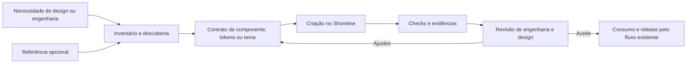

# Registro técnico da demonstração Horizon

> Registro histórico do experimento, preservado em 3 de outubro de 2026. Descreve possibilidades exploradas e resultados locais, sem homologação de design ou autorização de release. A proposta decisória atual está na [RFC Horizon](proposta.md). Os resultados abaixo pertencem à rodada original e não afirmam uma nova execução.

Documento para engenharia e design · levantamento de 3 de outubro de 2026

## Proposta executiva

A proposta é criar **Horizon como um novo tema do Shoreline**, ampliar o catálogo de tokens e dar ao time ferramentas para criar e validar componentes, tokens e temas diretamente no design system. Sunrise continua sendo o tema existente e padrão. Ambos podem evoluir conforme as decisões de design e engenharia, com impacto explícito e validação dos consumidores afetados.

Horizon segue o vocabulário de paisagem e luz de Shoreline e Sunrise. O nome permite uso em Studio e outras aplicações sem vincular o tema a um único produto. O AI Workspace oferece uma referência visual inicial; consultar ou extrair código daquele projeto não é uma etapa obrigatória para trabalhar no Shoreline.

A entrega combina inventário reproduzível, contratos por tipo de trabalho, contexto para agentes, validação de tokens e temas, políticas de arquitetura e estilos, lint, geração de componentes e uma matriz de navegador para todos os temas disponíveis. Reset e estilos globais comuns passam a ter fontes próprias; a descoberta de temas é compartilhada pelas ferramentas. Agentes ajudam a interpretar necessidades e propor soluções; programas verificam propriedades objetivas; engenharia e design avaliam semântica, comportamento e resultado visual.

O primeiro uso recomendado é consolidar as fundações do Horizon e completar a matriz de Button nesse tema. Em paralelo, o mesmo ferramental permite criar um componente novo, acrescentar tokens ao Sunrise ou definir outro tema, sem depender de um repositório externo.

## Arquitetura de temas e tokens

| Aspecto | Decisão |
| --- | --- |
| Componentes React | Compartilhados no pacote Shoreline, com APIs e primitivas acessíveis existentes. |
| Sunrise | Tema atual e padrão dos imports `@vtex/shoreline/css` e `@vtex/shoreline/themes/sunrise`. |
| Horizon | Tema adicional, selecionado por `@vtex/shoreline/themes/horizon`. |
| Tokens e estilos | Código fonte em `packages/shoreline/src/themes/<name>`; `packages/css` fornece o motor de transformação e build. |
| Fontes comuns | Reset e base em `packages/shoreline/src/foundations`, importados pelos temas e acompanhados pelo watcher. |
| Registro de temas | Descoberta central dos diretórios de tema; build, Plop, Storybook e matriz visual usam a mesma fonte. |
| Evolução | Mudanças intencionais podem atingir qualquer tema; o contrato declara temas afetados e ação esperada dos consumidores. |
| Validação | Cada tema é conferido segundo seu contrato, em documentos/builds isolados; herança de arquivos amplia os temas afetados. |

Aplicações escolhem Horizon pelo import de CSS:

```tsx
import '@vtex/shoreline/themes/horizon'
import { Button } from '@vtex/shoreline'
```

Os temas usam variáveis em `:root` e seletores globais. Cada documento carrega um tema completo. Importar dois temas no mesmo documento torna o resultado dependente da cascata; não estabelece isolamento por subtree. Componentes React e stories não injetam um tema como efeito colateral: a seleção ocorre na aplicação ou na configuração do Storybook.

Reset e estilos globais base ficam em [fontes compartilhadas](../../packages/shoreline/src/foundations/README.md), independentes de qualquer tema. Sunrise e Horizon importam essas fontes; uma correção comum é escrita uma vez. O diretório fica fora de `src/themes`, evitando que seja descoberto como um terceiro tema. As entradas do tema aplicam as cascade layers; as fontes importadas não repetem essas camadas. O watcher observa ambos os diretórios.

As [fundações do Horizon](../../packages/shoreline/src/themes/horizon/README.md) ainda herdam explicitamente os tokens e as regras de componentes Sunrise, acrescentando valores próprios. Esses arquivos contêm decisões de aparência e não foram promovidos integralmente a fontes neutras. Os seis tokens inicialmente adicionados em Horizon são `--sl-radius-4`, `--sl-font-weight-bold`, `--sl-shadow-3`, `--sl-shadow-4`, `--sl-shadow-5` e `--sl-overlay-bg`. Seu significado e uso podem ser expandidos para outros temas por uma decisão explícita. A simples existência de um token de overlay, por exemplo, não constitui o design completo de um modal.

Oito dimensões já existentes de Modal e EmptyState também foram promovidas a tokens sem mudar seus valores: larguras dos três tamanhos de Modal, largura mínima de botões do rodapé, larguras dos três tamanhos de EmptyState e tamanho da ilustração grande. Ficam em `sunrise/tokens-components.css` e são herdadas pelo Horizon. Dimensões que já pertencem à escala de espaçamento usam `--sl-space-*`.

Essa herança exige análise de impacto: modificar um arquivo Sunrise importado por Horizon pode alterar ambos. O objetivo dos testes é verificar a aparência e o comportamento pretendidos de cada tema e sua coexistência no pacote. Não há uma regra de congelamento de arquivos ou valores antigos do Sunrise. Um estilo compartilhado precisa encontrar seus tokens nos temas que suporta, receber fallback deliberado ou tornar o uso específico do tema.

O [registro de temas](../../tools/design-system/theme-registry.cjs) centraliza a descoberta, as entradas e os exports esperados. `pnpm ds themes` verifica o grafo de imports, entradas completas, camadas, exports e presença do reset/base compartilhados. Um novo nome entra na matriz pela descoberta; um diretório incompleto produz erro em vez de validação parcial. Cada tema oferece dez entradas CSS: tema completo, tokens, reset, base e componentes, com versões com e sem layers. O build mantém a limpeza de `dist` exclusivamente no `prebuild`, evitando que `tsup` apague CSS produzido em paralelo. O comando final `check:css` confere os exports CSS declarados no pacote.

## O que já existe no repositório

O levantamento inicial considerou Shoreline `d4aa0778ca9e20fe96a5eb41818594cb6ce09bc3`. O commit identifica a base antes deste ferramental; o inventário também registra arquivos pertinentes ainda não commitados e fingerprints, pois o commit sozinho não descreve uma árvore modificada. Os números abaixo caracterizam essa base, não o estado futuro do catálogo.

| Evidência inicial | Como aproveitamos |
| --- | --- |
| 53 famílias de componentes, excluindo diretórios auxiliares | Reutilizar primitivas e composição antes de criar capacidades duplicadas. |
| 266 tokens distintos no CSS Sunrise | Comparar a expansão proposta com o catálogo existente e justificar sua semântica. |
| 103 arquivos de stories; 50 Show, 29 Examples e 14 Play | Reaproveitar a documentação e completar matrizes de estados; contagem de arquivos não mede cobertura. |
| Nove arquivos unitários em oito famílias; quatro callbacks de interação identificados | Planejar testes comportamentais conforme cada mudança. |
| Code Connect com 38 entradas e 33 arquivos gerados | Associar decisões de design e implementação sem recriar a integração. |
| React 18, Ariakit, React Aria, CSS Layers, TypeScript, Vitest, Storybook e Chromatic | Usar a infraestrutura técnica já adotada pelo time. |

As evidências estão nos [componentes](../../packages/shoreline/src/components), [tokens Sunrise](../../packages/shoreline/src/themes/sunrise/tokens.css) e [manifesto Code Connect](../../code-connect/shoreline-components.json). A distinção entre o motor CSS e o diretório de temas evita orientar um agente para o lugar errado.

O AIW Styleguide também foi auditado como referência opcional, no commit `baceafacc9e32a863987dad06da5a6654b387d6b`. É uma aplicação que contém wrappers do Shoreline, folhas globais, dependências e funcionalidades de produto. Button, por exemplo, já usa o componente Shoreline e encaminha props/ref. Esses achados ajudam a comparar intenções visuais e oportunidades de composição, sem tornar a aplicação a fonte obrigatória das APIs do design system.

O inventário de referência contou 1.391 arquivos textuais pertinentes; os 1.711 arquivos rastreados por Git incluem também assets e outros itens fora desse recorte. O projeto possui `scripts/verify-guide.mjs`, com 20 grupos de verificações e manifesto de integridade. Portanto, ausência de `*.test.*` ou stories não demonstra ausência de testes. `src/theme/sl-theme.css` é legado: a referência ativa deve ser confirmada pelos imports da aplicação.

| Referência observada | Pergunta útil para o design system |
| --- | --- |
| Button, IconButton, Tag e Spinner | Quais diferenças são decisões de tokens, variantes ou composição de componentes existentes? |
| Link, Tab, Content e estilos de Drawer/Modal | Quais regras são próprias de um tema e quais descrevem comportamento compartilhado? |
| Avatar, Card, List, Chip, Timeline e Collapsible | Há uma capacidade reutilizável com estados, semântica e acessibilidade bem definidos? |
| OverviewCard, TasksTable, Conversation e Composer | Quais partes são produto e quais capacidades genéricas merecem um contrato próprio? |
| Gráficos de OverviewCard | O pacote `packages/charts` já resolve a necessidade? |

Esse mapa é insumo de descoberta. O fluxo nativo continua válido quando o design nasce diretamente no Figma, numa discussão do time ou em outro produto.

## Regras existentes e divergências visíveis

A [constituição privada](https://github.com/vtex/shoreline-specs/blob/main/.specify/memory/constitution.md), versão 1.0.1, e os [padrões de engenharia](https://github.com/vtex/shoreline-specs/blob/main/docs/patterns.md) foram consultados no levantamento. A constituição prevalece sobre [AGENTS.md](../../AGENTS.md). As referências diárias incluem o [Code styleguide local](../../packages/docs/pages/guides/code/code-styleguide.mdx), também [publicado](https://shoreline.vtex.com/guides/code/code-styleguide), e o [Storybook guideline local](../../packages/docs/pages/guides/code/storybook-guideline.mdx), também [publicado](https://shoreline.vtex.com/guides/code/storybook-guideline).

As skills carregam divergências verificadas para evitar decisões silenciosas:

- O guia prefere desestruturar props no corpo; a constituição exige defaults na assinatura. Prevalece a constituição, e a documentação de governança precisa ser reconciliada.
- O guia ainda descreve Sass, enquanto o código usa CSS e layers aplicadas por imports e build. Os validadores reconhecem o caminho efetivo de CSS.
- Play é playground de controles; Show é matriz visual; Examples demonstram uso; `stories/tests` contém interações. Um nome de arquivo não comprova execução.
- Exemplos antigos associavam CSS ao componente. A seleção centralizada de temas mantém JSX compartilhado sem imports de tema e evita contaminar previews.
- A constituição exige 80% de cobertura por pacote público; a configuração auditada não implementava esse limite, e a execução Storybook estava comentada na CI. Essas lacunas continuam explícitas até serem resolvidas.
- Remover ou renomear exports exige o processo de depreciação previsto na constituição. O campo de impacto documenta a mudança e a ação dos consumidores; criar um tema não autoriza alterar esse processo.

## Ferramentas construídas

O código reside em [tools/design-system](../../tools/design-system). Ele usa as dependências do monorepo e produz dados utilizáveis por pessoas, agentes e CI.



**Inventário e contexto.** O inventário identifica pacotes, famílias, tokens, stories, testes, imports e seletores por análise TypeScript/CSS. A origem externa é opcional. Os relatórios têm caminhos relativos, ordenação estável, diagnósticos e fingerprints; dependências, arquivos gerados, symlinks e arquivos comuns de credenciais são excluídos. O contexto reúne arquivos e regras pertinentes, incluindo arquivos planejados que ainda não existem num rascunho.

**Contratos nativos.** O formato interno `schemaVersion: 3` suporta `kind: component`, `tokens` ou `theme`. Cada contrato declara intenção, arquivos, temas afetados, semântica dos tokens e impacto para consumidores. A referência externa é um campo opcional com proveniência fixada. Exemplos: [Button](../../design-system/contracts/components/button.json), [fundações de tokens](../../design-system/contracts/tokens/horizon-foundations.json) e [tema Horizon](../../design-system/contracts/themes/horizon.json). `ds init` gera um contrato em rascunho para o tipo solicitado; não cria evidências nem aprova o design.

**Validação de tokens e temas.** `ds tokens` verifica entradas CSS e relações entre definições/referências, considerando imports locais. `ds check` integra essas verificações ao fluxo de contratos e arquivos alterados. O escopo não depende de um nome fixo de tema. Tokens podem ser criados no Sunrise, no Horizon ou em outro tema; a decisão precisa declarar consumidores e impacto. A validação estática não substitui semântica, contraste ou estilos computados no navegador.

O catálogo aceita declarações incondicionais em `:root` e layers; condições que impedem essa interpretação são reportadas. `ds check` verifica os catálogos e a estrutura de todos os temas, com referências dos arquivos selecionados. Ao alterar ou remover um token já consumido, `ds tokens --components` amplia a auditoria para estilos e referências literais suportadas no JSX dos componentes, inclusive arquivos não alterados. O verificador analisa aliases locais, ciclos e referências ausentes; uma declaração em um componente diferente não libera automaticamente o uso daquele nome.

Um token representa uma decisão reutilizável de design. Uma variável local pode representar dados de uma instância ou a composição entre componentes. O [contrato de variáveis de componentes](../../design-system/component-variables.json) distingue esses casos com motivo, produtor e consumidores explícitos. O índice de empilhamento de Toast e as colunas calculadas de Table continuam valores de runtime; não viram tokens de design. O verificador confirma a escrita no elemento JSX ou arquivo CSS informado e o consumo correspondente. Ainda é necessário verificar no navegador se a composição e a herança fornecem o valor nos estados corretos.

**Políticas e lint.** TypeScript AST e PostCSS detectam imports profundos entre componentes, dependências de aplicação, estilos inline literais, variantes computadas por `className`, cores/dimensões literais em componentes, variáveis fora de `--sl-*`, `!important` e ausência de caminho para `sl-components`. Tokens podem definir seus valores na camada adequada. O perfil Biome reforça hooks, dependências de efeitos, `any`, índices como keys e verificações de acessibilidade com a versão 1.9.4 já instalada. Dívida existente aparece em `--all`, sem supressão automática.

**Geração e distribuição.** Plop cria componentes com `forwardRef`, Options/Props, JSDoc, barrels, testes e categorias de stories. `pnpm gen:component <Name> <theme>` direciona os estilos ao tema escolhido. Novos temas precisam de entradas CSS, exports e validação da distribuição; o contrato é o início desse trabalho, não um substituto do código. Um componente com estilos em apenas um tema precisa de implementação adicional antes de prometer suporte aos demais.

Plop, o build CSS, Storybook e a matriz visual usam o mesmo registro de diretórios. Isso elimina listas independentes de Sunrise/Horizon nos pontos de seleção e permite crescer sem esquecer um tema no teste. A existência do diretório permite seleção, mas não dispensa validar seu conteúdo e publicar os exports necessários.

**Evidências por tipo.** A passagem para `ready-for-review` exige questões abertas resolvidas e resultados correspondentes ao tipo de mudança:

| Tipo | Evidências exigidas |
| --- | --- |
| Componente | Unidade, interação, visual, acessibilidade, tipos, cobertura e regressão entre temas. |
| Tokens | Validação de tokens, build, visual e acessibilidade. |
| Tema | Validação de tokens, build, visual, acessibilidade e regressão entre temas. |

Evidências com resultado `pass` precisam existir e conferir com seu SHA-256 e com o fingerprint das decisões, todos os temas disponíveis, imports CSS transitivos, fontes dos pacotes públicos, contratos de variáveis, configurações, runner e baselines. A adição de um tema também invalida recibos antigos. Evidências de visual, acessibilidade e regressão declaram os temas exercitados; readiness exige todos os registrados. O artefato visual precisa ser um `run.json` de comparação completa bem-sucedida no ambiente canônico. Capturas diagnósticas e candidatos a baseline não atendem esse requisito. Isso verifica consistência e integridade; não autentica pessoas nem prova que o teste é suficiente.

## Validação visual e acessibilidade em todos os temas

O requisito de contribuição passa a ter uma execução verificável: **cada story Show × cada tema registrado × desktop e mobile**. O manifesto é construído a partir dos índices reais de cada build Storybook e exige a mesma coleção não vazia de Show em todos os temas. Um tema adicionado amplia a matriz automaticamente. Os viewports são 1280×900 e 390×844, ambos em Chromium; isso não equivale a testes em aparelhos reais ou em todos os motores de navegador.

O [runner visual](../../tools/design-system/visual) cria um build e documento isolado por tema. Não alterna folhas globais dentro do mesmo documento. Antes da execução, confere se fontes, configuração, CSS distribuído e índices continuam correspondendo ao manifesto. Um build antigo não serve de evidência para arquivos novos. O relatório de execução também precisa cobrir toda a matriz; filtros e casos ignorados não completam o gate.

Cada caso aguarda a finalização de renderização e do `play` da story, fontes e imagens, verifica erros de navegador, executa axe e registra screenshot da página completa. Data, aleatoriedade, locale, fuso, movimento e pixel ratio têm configuração estável. A captura bloqueia recursos externos; fixtures devem usar dados e assets locais. Uma referência visual ausente, um erro de execução ou uma violação axe não é aceito como captura válida.

Há três operações com significados diferentes:

| Operação | Resultado e limite |
| --- | --- |
| `pnpm ds:visual:check` | Compara a matriz completa com baselines existentes; não atualiza imagens. Diferenças, imagens ausentes e execução incompleta falham. |
| `pnpm ds:visual:capture --grep button` | Captura diagnóstica filtrada, com erros e axe ainda verificados. Não demonstra regressão visual aprovada. |
| `pnpm ds:visual:update` | Gera candidatos a baseline fora da CI, com o sinalizador explícito definido no script. Cada imagem precisa de revisão antes de ser incorporada. |

Execute `pnpm build` e `pnpm ds:visual:build` antes dessas operações. O manifesto fica em `artifacts/design-system/storybooks/manifest.json`; cada execução gera `run.json`, relatórios, screenshots e anexos de acessibilidade em `artifacts/design-system/visual/<modo>`. As baselines revisadas ficam em `design-system/visual-baselines`, separadas por plataforma, navegador, tema e viewport.

O ambiente de referência é Linux com Chromium empacotado pelo Playwright 1.44.1, na imagem `mcr.microsoft.com/playwright:v1.44.1-jammy`. A CI declara essa imagem em `SHORELINE_VISUAL_ENVIRONMENT`; o recibo registra versão do Node, Playwright, axe, SO, arquitetura e navegador. Essa declaração descreve o ambiente de execução e não constitui atestação criptográfica. Atualizar a versão exige regenerar e revisar referências no ambiente correspondente. Essa escolha segue a orientação do [Playwright sobre consistência do ambiente de imagens](https://playwright.dev/docs/test-snapshots) e [compatibilidade entre imagem e pacote](https://playwright.dev/docs/docker). Capturas locais em macOS ou Chrome ajudam no diagnóstico, mas não substituem a baseline canônica.

A primeira baseline requer revisão de engenharia e design: registrar a aparência atual pode preservar um defeito se o time apenas aceitar todas as imagens. Os modos de captura e atualização declaram essa revisão como pendente. O check técnico demonstra igualdade com uma referência, não aprovação estética ou completude dos estados. Um estado que não foi incluído em Show continua fora da evidência; por isso permanece o requisito do guia de acrescentar as variantes visuais à matriz.

Chromatic permanece como serviço de revisão compartilhada. Para ser um gate, a execução precisa esperar o resultado e falhar diante de diferenças não aceitas (`exitZeroOnChanges: false`), sem aceitar alterações automaticamente; encerrar após upload não comprova aprovação. Esse comportamento está documentado nas [opções Chromatic](https://www.chromatic.com/docs/configure/) e na [integração GitHub Actions](https://www.chromatic.com/docs/github-actions/). O projeto existente de Sunrise não deve receber uploads alternados de todos os temas, pois isso misturaria referências. A matriz local cobre todos os temas; ampliar revisão hospedada exige projetos/baselines separados e sua configuração pelo time.

Axe cobre regras automatizáveis dos estados renderizados. Não substitui navegação por teclado, movimento de foco, zoom, tecnologias assistivas e revisão semântica. A [orientação de acessibilidade do Storybook 8](https://storybook.js.org/docs/8/writing-tests/accessibility-testing) ajuda a compor essas camadas. Gates de cobertura e interações completas continuam separados da comparação de screenshots.

## Agentes e responsabilidades humanas

As skills de [descoberta](../../tools/design-system/skills/shoreline-discovery/SKILL.md), [criação](../../tools/design-system/skills/shoreline-create/SKILL.md) e [revisão](../../tools/design-system/skills/shoreline-review/SKILL.md) ficam versionadas no repositório. Nenhuma skill global ou serviço de orquestração é necessário. A primeira encontra capacidades existentes e delimita a mudança; a segunda orienta a criação nativa de componentes, tokens e temas; a terceira procura diferenças entre contrato, resultado e evidências.

Design decide semântica, intenção visual, estados e composições. Engenharia responde por API, distribuição, dependências, ref/props e testes. Os agentes ajudam a organizar essas decisões e executar verificações, sem inventar aceite de design, cobertura, execução de CI ou referências Figma.

As [regras oficiais do React](https://react.dev/reference/rules) apoiam a revisão de pureza, hooks e imutabilidade dentro das decisões locais de React 18. Acessibilidade combina automação com teclado, foco, zoom, movimento e tecnologia assistiva; o [ARIA APG](https://www.w3.org/WAI/ARIA/apg/) orienta comportamento esperado.

## Pesquisa e adoção de ferramentas

| Capacidade | Uso nesta proposta | Próximo passo |
| --- | --- | --- |
| TypeScript AST, PostCSS e CLI | Inventário e regras determinísticas no repo | Ampliar com casos reais e fixtures. |
| Biome 1.9.4 | Lint mais rigoroso para o escopo de trabalho | Avaliar dívida antes de ampliar o perfil. |
| Plop, contratos e skills | Criação e revisão nativas | Exercitar componentes, tokens e temas independentes. |
| Playwright, Storybook, axe e Chromatic | Matriz Show por tema/viewport, screenshots e axe; serviço de revisão já existente | Revisar a baseline inicial e habilitar os checks obrigatórios na CI; ampliar casos comportamentais. |
| Vitest e TypeScript | Infraestrutura existente reaproveitada | Completar cobertura constitucional por pacote e verificar tipos/APIs. |
| Stylelint | Alternativa pesquisada para regras amplas de linguagem CSS; não instalado | Considerar apenas diante de lacunas demonstradas, com plano de convivência com Biome. |
| Figma Code Connect | Manifesto e gerador existentes | Associar componentes/tokens aprovados e executar dry-run. |
| DTCG e Style Dictionary | Referências pesquisadas; conversor não instalado | Adotar quando houver fonte canônica de tokens acordada com design. |
| API Extractor, tsd, dependency-cruiser e codemods | Opções avaliadas; não instaladas | Introduzir conforme um problema concreto exigir. |

O [formato DTCG 2025.10](https://www.designtokens.org/tr/2025.10/format/) descreve tipos, valores e aliases para intercâmbio de tokens; é uma especificação do Community Group, não uma recomendação W3C. O contrato de tarefas desta entrega é um formato interno. Adoção futura requer acordar fonte canônica, nomes, responsáveis e saídas geradas com design, evitando dois catálogos manuais concorrentes. A [compatibilidade DTCG do Style Dictionary](https://styledictionary.com/info/dtcg/) precisa ser conferida para a versão escolhida. A [v5 exige Node 22](https://styledictionary.com/versions/v5/migration/), acima do mínimo Node 20 atual, portanto sua adoção envolve decisão adicional de plataforma.

[Stylelint](https://stylelint.io/user-guide/rules/) oferece regras de linguagem CSS, incluindo validação de pares propriedade/valor e referências a custom properties. Sua [documentação de propriedades e valores](https://stylelint.io/user-guide/rules/declaration-property-value-no-unknown/) descreve limites e sobreposições entre regras. É uma opção para lacunas concretas, não uma dependência adicionada por precaução. O grafo de tokens por tema e os contratos de produtores/consumidores continuam sendo regras específicas do Shoreline.

Os validadores próprios ficam separados do Biome porque plugins pertencem à [linha 2 do Biome](https://biomejs.dev/blog/biome-v2/). O perfil funciona na versão 1.9.4 já usada, evitando atrelar a criação do tema a uma troca da infraestrutura de lint.

[API Extractor](https://api-extractor.com/pages/setup/configure_api_report/) permite revisar a superfície pública em relatórios; [tsd](https://github.com/tsdjs/tsd) verifica exemplos tipados; [dependency-cruiser](https://github.com/sverweij/dependency-cruiser/blob/main/doc/rules-reference.md) aprofunda dependências; [jscodeshift](https://jscodeshift.com/run/cli/) automatiza adaptações de consumidores depois de decisões concretas. Não foram instalados sem um caso que justifique sua manutenção.

Para imagens de referência, a [documentação Playwright](https://playwright.dev/docs/test-snapshots) orienta controlar navegador, viewport, fontes, dados e animações. A [integração de acessibilidade do Storybook 8](https://storybook.js.org/docs/8/writing-tests/accessibility-testing) oferece uma camada automatizada, complementada por revisão manual.

## Como o time começa

Com as dependências instaladas, na raiz do repositório:

```sh
pnpm ds inventory --out artifacts/design-system/inventory.json
pnpm ds themes
pnpm ds tokens --components
pnpm ds init tokens surface-tokens --theme horizon --out design-system/contracts/tokens/surface-tokens.json
pnpm ds contract design-system/contracts/tokens/horizon-foundations.json
pnpm ds context design-system/contracts/themes/horizon.json --out artifacts/design-system/horizon-context.json
pnpm ds check --base HEAD --lint
pnpm ds:test
pnpm build
pnpm ds:visual:build
pnpm ds:visual:check
```

Para um novo componente, use `pnpm gen:component <Name> horizon`, ou outro tema definido pelo contrato. Para explorar Horizon, use `pnpm dev:storybook:horizon`; `pnpm build:storybook:horizon` grava o build isolado em `storybook-static-horizon`. Os comandos usuais sem seleção continuam no Sunrise. Referências externas entram apenas quando úteis, por exemplo `pnpm ds inventory --source ../aiw-styleguide`.

O fluxo de trabalho é: descobrir a capacidade existente; registrar o tipo de mudança e seu impacto; criar código/tokens/tema; executar as verificações aplicáveis; revisar com engenharia e design; documentar consumo e seguir o release do projeto. Não é necessário inventar estados de componente para um contrato de tokens, nem buscar uma origem externa para uma ideia nova.

`pnpm ds fingerprint <contrato>` produz a identificação dos inputs para os recibos. Depois dos testes, `pnpm ds contract <contrato> --ready` verifica integridade e completude. Códigos de saída distinguem checks aprovados (`0`), achados (`1`) e entradas inválidas/erro de execução (`2`). Aprovar o formato de um rascunho não significa ter concluído sua implementação.

## Critérios de adoção e limites

Começar pelas fundações Horizon e por Button permite testar tokens, estados, teclado e composição. Um campo e um overlay ampliam a avaliação para erros, descrições, foco e abertura/fechamento. Também é necessário exercitar uma expansão de tokens em mais de um tema e uma criação sem referência externa, para verificar que o processo serve ao trabalho cotidiano do time.

Medir tempo até trabalho aceito, ciclos de revisão, estados previstos versus demonstrados, achados determinísticos, defeitos após revisão, esforço dos consumidores e afirmações de agentes sem evidência. Os [cenários de avaliação](../../tools/design-system/evals.md) incluem tipos diferentes de contratos, origem opcional divergente, inputs alterados e dependências transitivas de tema. A proposta de avaliar resultados executáveis e repetir tarefas segue as [práticas de avaliação de agentes da Anthropic](https://www.anthropic.com/engineering/demystifying-evals-for-ai-agents). Casos pontuais não constituem benchmark de confiabilidade.

Os checks não resolvem todos os aliases, spreads, estilos indiretos, imports computados ou contratos públicos. Igualdade de valor entre tokens não prova igualdade de significado; um grafo válido não garante contraste. O piso constitucional continua sendo 80% de cobertura por pacote público; cobertura de um arquivo isolado não o satisfaz.

A estratégia de CI reúne checks de código, tokens/estrutura de temas, contratos e a matriz visual completa. O [workflow design-system](../../.github/workflows/design-system.yml) mantém o fluxo nativo sem checkout externo. A execução manual permite capturas diagnósticas com nome de job distinto do gate de comparação; esse resultado não deve ser usado como check obrigatório de aprovação visual. O registro de temas participa das dependências globais do Turbo para invalidar o cache quando muda. O time precisa confirmar a execução remota, os secrets do serviço de revisão e quais jobs são obrigatórios na proteção de branch. Falhas de infraestrutura e ausência de baseline permanecem visíveis. O runner não altera essas configurações administrativas e não concede aceite de design ao Horizon.

## Validação registrada e trabalho de adoção

Esta rodada acrescentou validação estrutural dos temas, fontes comuns, análise explícita de variáveis de componentes e o runner de navegador. Os resultados abaixo distinguem checks executados de critérios de adoção ainda pendentes.

| Verificação desta rodada | Evidência disponível |
| --- | --- |
| Extração isolada de reset/base | Os 20 CSS gerados permaneceram byte a byte iguais antes e depois da extração. Essa comparação antecede as correções de referências abaixo. |
| Watcher de CSS | Alterar a fonte base compartilhada disparou a regeneração dos 20 outputs. |
| Referências de tokens em todos os componentes | Auditoria completa sem diagnósticos após as correções; catálogos com 274 tokens Sunrise e 280 Horizon. |
| Testes do ferramental | 100 testes passaram, incluindo propagação das fontes comuns, novos temas, referências, camadas, geração, fingerprints e rejeição de recibos diagnósticos como aprovação visual. |
| Testes existentes da biblioteca | 179 testes passaram em 30 arquivos; isso não demonstra o piso de cobertura por pacote. |
| Build e lint | Seis tarefas de build passaram; Biome passou em 1.123 arquivos. |
| Checks dos arquivos alterados | Sem diagnósticos de políticas/tokens/temas; três contratos permanecem rascunhos válidos. |
| Auditoria ampla de políticas | 89 achados em código existente fora dos arquivos corrigidos: 10 estilos inline literais, 4 imports profundos, 49 literais CSS, 24 variáveis sem prefixo e 2 usos de `!important`. Sem supressões automáticas. |
| Storybook | Builds isolados para Sunrise e Horizon; manifesto com 51 Show (50 Shoreline e 1 charts), totalizando 204 cenários. |
| Navegador local | 204 cenários executados, 204 capturas, nenhum caso ignorado: 168 passaram nos checks de renderização/axe e 36 falharam por acessibilidade. Execução diagnóstica em macOS/Chrome, sem comparação com baselines. |
| Baseline inicial, CI remota e aceite de design | Pendentes de geração/revisão no ambiente canônico e de verificação pelo time. |

A matriz local encontrou os mesmos nove casos em cada combinação de tema e viewport. São achados dos estados demonstrados nas stories; a triagem precisa distinguir problemas do componente, do tema e da própria fixture:

| Regra axe | Stories afetadas | Cenários que falharam |
| --- | --- | --- |
| `color-contrast` | ChartTooltip e Text | 8 |
| `button-name` | ConfirmationModal, Modal e Select | 12 |
| `target-size` | DatePicker e DateRangePicker | 8 |
| `label` | Input e Textarea | 8 |

O recibo `artifacts/design-system/visual/capture/run.json` registra a matriz completa, resultado diagnóstico e código de saída 1. Os 204 casos geraram imagem e anexos axe/ambiente; o relatório abre com `pnpm exec playwright show-report artifacts/design-system/visual/capture/html`. Não houve erro de renderização/console nessa execução final. As imagens de Button em Sunrise e Horizon foram inspecionadas e mostram as respectivas diferenças de paleta e raio; isso confirma a seleção isolada, sem constituir aceite do design. Nenhuma baseline foi criada ou aprovada.

A auditoria identificou sete referências ausentes em quatro arquivos: foreground em EmptyState e Table, background do container de Modal, três referências a paddings de cabeçalho Modal sem consumo e letter-spacing de Radio. Os nomes ativos agora resolvem para os tokens semânticos correspondentes; as três atribuições sem uso foram removidas. A tokenização das dimensões preserva seus valores. As referências corrigidas podem mudar propriedades antes inválidas, como o background transparente padrão do container Modal; essas diferenças precisam aparecer na revisão dos dois temas.

As variáveis fornecidas por runtime ou composição foram separadas dos defeitos e receberam produtores/consumidores verificáveis. Assim, zero referências ausentes não depende de permitir qualquer nome já visto no CSS. Ainda há limites estáticos: a análise não prova herança e existência do produtor em cada árvore DOM. A auditoria ampla de políticas de código também deve continuar visível, separada do resultado do grafo de tokens.

A rodada anterior validou o fluxo nativo e os três contratos em rascunho, incluindo um exercício independente sem repositório de referência. Esses contratos continuam rascunhos; exemplos de estrutura não representam evidências completas para release. O [runbook](../../tools/design-system/README.md) registra o uso operacional e os [cenários de avaliação](../../tools/design-system/evals.md) orientam novas execuções independentes.

A adoção começa por executar a matriz completa no ambiente fixado, corrigir os achados observados, revisar as primeiras imagens e tornar os checks acordados obrigatórios. Depois, cada alteração de componente, token ou fonte comum precisa manter coerência em todos os temas disponíveis. Cobertura por pacote, interações adicionais e revisão manual permanecem obrigações próprias. O Horizon continua experimental até reunir evidências suficientes de estados, contraste, interação e aprovação de design.
