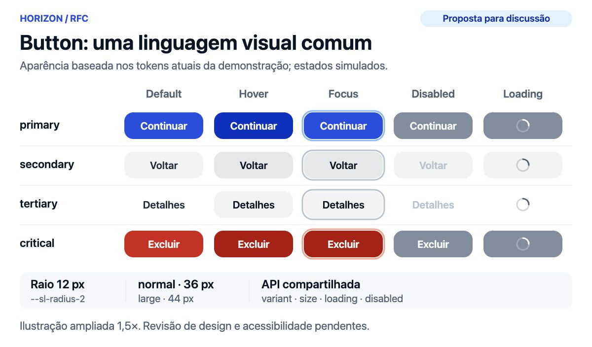
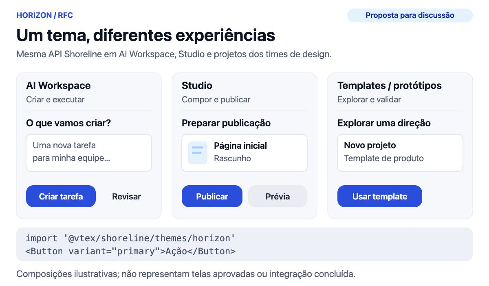

# RFC: Horizon — tema do Shoreline

**Criada em:** 3 de outubro de 2026 · **Status:** Rascunho para revisão · **Versão:** 0.1

**Proponente:** William Cunha · **Revisores propostos:** Design System, AI Workspace, Studio e Design (responsáveis a confirmar).

**Histórico:** 2026-10-03 — proposta inicial, fundamentada nos três repositórios e em uma demonstração visual de Button.

## Resumo

Propomos construir **Horizon como um tema adicional do Shoreline**, para uso no **AI Workspace, no Studio e nos templates e protótipos dos times de Design**. O tema reunirá decisões visuais hoje distribuídas em estilos de aplicação: cores, superfícies, tipografia, raios, sombras e estados dos componentes. O comportamento, a acessibilidade e a API React continuarão compartilhados no Shoreline.

A decisão solicitada é aprovar essa direção e um piloto com Button e IconButton, seguido de um campo e um overlay. Sunrise continuará como tema padrão. Cada consumidor adotará Horizon explicitamente, com validação e migração próprias.

**O código existente é uma demonstração de possibilidades.** A branch de referência contém o experimento de tema e de ferramental, não uma implementação homologada. Esta RFC abre a revisão de escopo, visual e arquitetura; não aprova publicação, migração em massa nem todos os detalhes da demonstração.

## Motivação

O AI Workspace já usa Shoreline, mas aplica sua identidade por meio de tokens globais, overrides e wrappers locais. O styleguide torna essa linguagem visível em demonstrações. Sem uma fonte compartilhada, novas superfícies tendem a copiar essas decisões e evoluí-las separadamente.

Horizon permitirá que uma correção de estado, contraste ou aparência seja revisada no design system e consumida de forma versionada. Para Design, isso aproxima o protótipo da implementação disponível; para os produtos, reduz a manutenção de CSS que repete decisões do tema. Esses benefícios são hipóteses a medir no piloto, não ganhos já demonstrados.

## Objetivos e não objetivos

O primeiro ciclo deve estabelecer tokens semânticos, demonstrar componentes existentes com a nova apresentação e validar o consumo nos três contextos. Também deve definir quem mantém as decisões e como elas chegam à documentação, ao código e às referências de Design.

Ficam fora deste ciclo: substituir Sunrise como padrão; criar outra biblioteca React; migrar todas as telas; transformar Composer, Conversation ou TasksTable em componentes genéricos; aprovar dark mode; e incorporar automaticamente todos os tokens ou wrappers dos produtos. Ferramentas de agentes e automação apoiam a revisão, mas não são o objeto principal da RFC.

## O que temos hoje

**AI Workspace — aplicação real.** Em `admin-platform`, o shell importa CSS de Shoreline, Agentic UI e charts, seguido de estilos locais. `app/theme.css` define cinzas azulados, azul de ação, raios mais amplos e sombras. Button e IconButton são wrappers de Shoreline; Button acrescenta `shape` e `tone`. A story de Button desabilita a regra automatizada de contraste, portanto esse exemplo não deve ser tomado como validação de acessibilidade. [Fonte: shell e estilos](https://github.com/vtex/admin-platform/tree/7bb6cb122dd5ee45cc1bc0031a84fb8b9a130508/ai-workspace/shell).

**AIW Styleguide — catálogo e referência.** Documenta o `ai-workspace-shell-template`, incluindo fixtures e mocks. Usa `app/theme.css`; `src/theme/sl-theme.css` é uma proposta legada e não participa dos previews. O inventário reproduzido de declarações incondicionais em `:root` contém 400 tokens: 266 herdados de Sunrise e 134 exclusivos da aplicação; 61 dos herdados têm valor resolvido alterado. Esse recorte evidencia personalização, não recomenda migrar os 134 tokens integralmente. [Fonte: catálogo e método](https://github.com/vtex/aiw-styleguide/tree/baceafacc9e32a863987dad06da5a6654b387d6b).

**Shoreline — experimento.** A demonstração adiciona Horizon, reaproveita componentes e regras de Sunrise, centraliza reset/base e explora seleção de temas, contratos e validações. Horizon tem 280 tokens no catálogo composto, dos quais seis ampliam o vocabulário herdado. A herança é uma escolha do experimento a revisar: mudanças em Sunrise podem repercutir em Horizon.

**Studio — consumidor previsto.** O checkout contém uma [página FastStore Studio](https://github.com/vtex/admin-platform/blob/7bb6cb122dd5ee45cc1bc0031a84fb8b9a130508/admin/admin-ai/pages/faststore-studio/index.tsx) que usa Shoreline, mas isso não identifica nem valida toda a superfície Studio pretendida. O time deverá escolher o fluxo piloto e confirmar sua arquitetura. Os repositórios analisados também usam versões diferentes de Shoreline e Agentic UI; compatibilidade precisa ser exercitada, não presumida.

## Proposta

### Um tema, componentes compartilhados

Horizon deve pertencer a `@vtex/shoreline`, com tokens e CSS em `packages/shoreline/src/themes/horizon`. O pacote `@vtex/shoreline-css` continuará como motor de build. Componentes React manterão APIs, composição, refs e propriedades ARIA existentes.

O consumo proposto seleciona o CSS na entrada da aplicação:

```tsx
import '@vtex/shoreline/themes/horizon'
import { Button } from '@vtex/shoreline'

<Button variant="primary">Criar tarefa</Button>
```

Esse export existe na demonstração da branch; a RFC não afirma que esteja disponível na versão publicada. `@vtex/shoreline/css` continuará selecionando Sunrise. Como os temas usam `:root` e seletores globais, cada documento carregará um tema completo. A mistura de Sunrise e Horizon na mesma árvore, inclusive em portais, exige uma solução de isolamento própria antes de ser prometida.

### Tokens e fronteiras

Design e Engenharia deverão consolidar papéis semânticos para ação, texto, superfície, foco, desabilitado e criticidade. A direção inicial usa neutros azulados, azul de ação e cantos mais amplos. Valores iguais não bastam para tornar dois tokens equivalentes; os nomes precisam expressar o uso pretendido.

Reset e base podem ser compartilhados. A herança atual de paleta e regras Sunrise deve ser avaliada por componente, com testes nos dois temas. Alterações necessárias em Sunrise serão explicitadas e revisadas; criar Horizon não autoriza mudanças incidentais no tema existente.

Horizon cuidará da apresentação reutilizável. Os consumidores continuarão responsáveis por conteúdo, navegação, dados e estados de negócio. Agentic UI manterá suas responsabilidades de conversa; a compatibilidade de tokens e estilos entrará no piloto do AI Workspace. Tokens de sidebar, dimensões de telas e empilhamento de produto não serão promovidos automaticamente.

### Button como demonstração

A proposta mantém as variantes públicas `primary`, `secondary`, `tertiary`, `critical` e `criticalTertiary`, os tamanhos `normal` e `large` e o estado `loading`. A prancha destaca quatro variantes e estados representativos; a matriz de aceite deve incluir todas as variantes, foco por teclado, pressionado, desabilitado, carregamento, ícone com texto e textos longos.



*Figura 1. Exploração visual para discussão, baseada nos tokens da demonstração. Ilustração estática; não é captura de um componente homologado nem evidência de acessibilidade.*

O ponto de partida é raio de 12 px, altura normal de 36 px, altura grande de 44 px e fundo primário azul `#1e4ee5` (alias semântico de `blue-10`), conforme o CSS exploratório. O foco deve continuar distinguível por um anel, e loading deve preservar a dimensão do botão e comunicar ocupação sem permitir reenvio. Valores, contraste e área de interação dependem do aceite do time.

O AI Workspace explora `shape` e o tom `success`; o template/styleguide acrescenta `toolbarOutline` e força um tamanho `small` ausente da tipagem que usa. Nenhuma dessas extensões se torna API pública por esta RFC. Sua necessidade compartilhada deve ser discutida separadamente.



*Figura 2. A mesma linguagem visual em três contextos de uso propostos. Composições ilustrativas, sem afirmar adoção ou representar telas reais dos produtos.*

## Adoção e critérios de aceite

Propomos avançar por etapas, sem fixar datas antes de o time estimar o escopo:

1. **Alinhar fundações.** Design System e Design confirmam tokens, estados, direção visual e referência de handoff; Engenharia revisa a estratégia de herança. Saída: decisões registradas e escopo do piloto aceito.
2. **Validar Button e IconButton.** Completar variantes e interações, tipos e documentação; revisar Sunrise e Horizon em documentos isolados, desktop e mobile. Saída: evidências reproduzíveis e revisão humana dos estados.
3. **Exercitar integrações.** AI Workspace valida um fluxo com Agentic UI; Studio escolhe um fluxo próprio; Design monta um template usando o mesmo pacote e tema. Um campo e um overlay ampliam o piloto para erro, foco e portais. Saída: exemplos executáveis e inventário de overrides removidos ou mantidos com justificativa.
4. **Preparar distribuição.** Mantenedores do Shoreline definem versão, documentação, migração e release pelo processo existente. Os produtos migram gradualmente. Saída: consumo sem cópia dos estilos de tema e rollback ensaiado para a versão/configuração anterior.

Antes de publicar, exigir build, tipos, lint, testes de unidade/interação e o piso constitucional de 80% de linhas por pacote público; comparação visual de todos os Show nos temas disponíveis e viewports acordados; contraste, nomes acessíveis, teclado, foco, zoom e tecnologias assistivas; e aceite de Design e Engenharia. Um teste automatizado ou screenshot isolado não substitui esses critérios.

A medição do piloto deverá registrar quantos overrides foram substituídos, divergências visuais encontradas, esforço para montar o template, ciclos de revisão e defeitos de integração. Cada time confirmará seu responsável e o fluxo usado na avaliação.

## Alternativas consideradas

| Alternativa | Benefício | Custo ou limite |
| --- | --- | --- |
| Manter overrides por produto | Menor investimento inicial | Decisões e correções continuam duplicadas. |
| Criar uma nova biblioteca de UI | Autonomia completa | Duplica APIs, comportamento e manutenção de acessibilidade. |
| Substituir o padrão Sunrise | Uma única aparência | Amplia migração e impacto antes de validar os consumidores. |
| Adicionar Horizon ao Shoreline | Reutiliza componentes e permite adoção explícita | Exige governança de tokens e regressão entre temas. |

Recomendamos a última alternativa. O investimento inicial pode permanecer concentrado em fundações e no piloto, sem transformar toda a experimentação de ferramental em pré-requisito para a decisão.

## Riscos e limites da demonstração

**Cascata e herança.** Overrides locais podem prevalecer sobre o tema, e arquivos herdados podem alterar mais de um consumidor. A mitigação proposta é inventário de imports/overrides, builds isolados e revisão dos temas afetados.

**Divergência de versões.** AI Workspace e styleguide usam versões distintas de dependências. O piloto deve fixar as versões realmente testadas, incluindo Agentic UI e charts, e verificar estilos computados e portais no produto.

**Falsa percepção de prontidão.** O registro diagnóstico existente executou 204 cenários locais em macOS/Chrome: 168 passaram nos checks de renderização/axe e 36 falharam por acessibilidade. A execução não comparou baselines aprovadas. Os quatro cenários de Button não registraram violações axe, o que não equivale a acessibilidade completa ou aprovação visual. Baseline canônica, CI remota, cobertura por pacote e aceite de Design permanecem pendentes. O detalhamento foi preservado no [registro técnico da demonstração](demonstracao-tecnica.md).

**Escopo excessivo.** A branch inclui ferramentas, templates e correções compartilhadas exploratórias. Após a decisão, o time deve separar tema, infraestrutura e correções em mudanças revisáveis, com regressões próprias. A aprovação da RFC não aprova o diff completo da branch.

## Questões para revisão

1. Concordamos em adotar Horizon como tema adicional para os três contextos, mantendo Sunrise como padrão?
2. Quais tokens, estados e referências de Design compõem o primeiro aceite de Button e IconButton?
3. Quais partes da herança de Sunrise devem permanecer e quais precisam de decisões próprias?
4. `shape`, sucesso e ações de toolbar representam necessidades compartilhadas ou composição dos produtos?
5. Qual fluxo de Studio será o piloto e há necessidade de dois temas no mesmo documento?
6. Quem responde pelas fundações, pelos três pilotos e pelo aceite para publicação?

## Referências

- [RFC de referência — LLM Assistant: state of the art](https://docs.google.com/document/d/1ORu3Kz_cwYL_yrtI7wx_YAbU-zzjAausQ2Hzcp8FAiY/edit?tab=t.6u2kbvehd5o9): organização em metadados, resumo, não objetivos, motivação, proposta, figuras e fontes.
- [Documento de revisão desta RFC](https://docs.google.com/document/d/1AAEpiZ9fc1is2leFOehiiErGc30aSyTTGyEBORPoouI/edit?tab=t.0).
- [Branch experimental: feat/horizon-theme-rfc](https://github.com/vtex/shoreline/tree/feat/horizon-theme-rfc). Base: `d4aa0778ca9e20fe96a5eb41818594cb6ce09bc3`; inclui a demonstração antes não commitada e esta RFC. Sua existência não representa aprovação para merge ou release.
- [AI Workspace — snapshot analisado](https://github.com/vtex/admin-platform/tree/7bb6cb122dd5ee45cc1bc0031a84fb8b9a130508/ai-workspace/shell): `app/layout.tsx`, `theme.css`, `globals.css` e wrappers de Button/IconButton.
- [AIW Styleguide — snapshot analisado](https://github.com/vtex/aiw-styleguide/tree/baceafacc9e32a863987dad06da5a6654b387d6b): `README.md`, `src/main.tsx`, `app/theme.css`, extrator de tokens e matriz de Button.
- [Constituição do Shoreline](https://github.com/vtex/shoreline-specs/blob/main/.specify/memory/constitution.md) e [padrões de engenharia](https://github.com/vtex/shoreline-specs/blob/main/docs/patterns.md), consultados para esta proposta.
- [Runbook da demonstração](../../tools/design-system/README.md) e [fundações Horizon](../../packages/shoreline/src/themes/horizon/README.md): detalhes operacionais fora do corpo decisório desta RFC.
