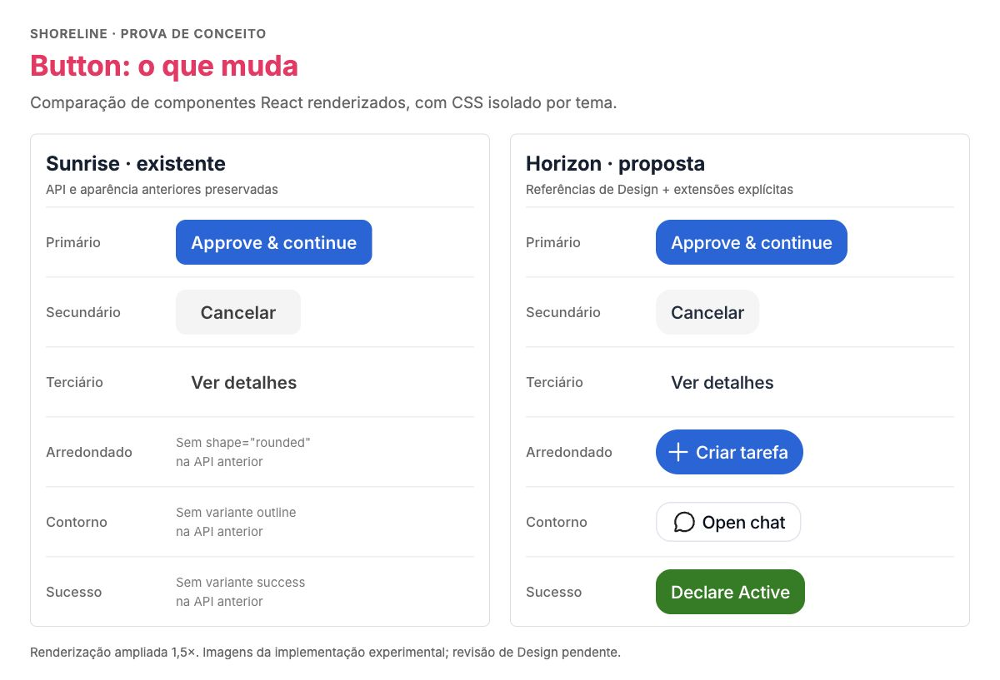
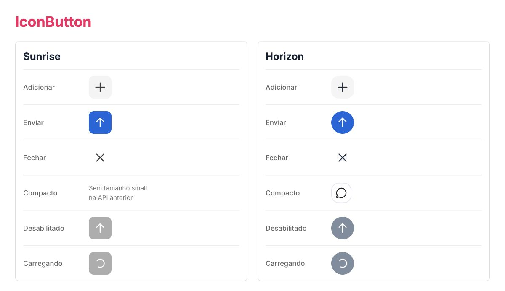

# RFC: Shoreline Horizon

| Criada em | 03/10/2026 | Status | Em revisão |
| --- | --- | --- | --- |
| Versão atual | 1.0 | Proponente | William Cunha |

Revisores propostos: Design System, AI Workspace, Studio e Design. Responsáveis a confirmar.

## Changelog

03/10/2026 · **1.0** — Proposta inicial.

## Resumo

Propomos construir **Horizon como um tema do Shoreline e uma base visual compartilhada pelo AI Workspace, pelo Studio e pelos templates e protótipos de Design**.

Hoje, o AI Workspace obtém parte de sua aparência **sobrescrevendo estilos e tokens de Shoreline dentro da aplicação**. O template usado por Design também mantém suas próprias adaptações e já diverge da implementação oficial. Como Studio precisará de uma interface similar, reproduzir esse modelo em mais um produto ampliará a duplicação de estilos, o retrabalho e a dificuldade de manter consistência. Essa forma de evolução não escala para os três contextos.

A proposta é tornar **Shoreline com Horizon a fonte da verdade das decisões visuais reutilizáveis**. Design poderá construir e validar interfaces com os mesmos componentes e tokens disponíveis no projeto oficial. O resultado esperado é reaproveitar a implementação aprovada, em vez de reconstruir a aparência de um protótipo em cada produto.

Esta RFC solicita acordo sobre a arquitetura, o escopo inicial e o processo de adoção. Todo o trabalho existente é uma demonstração inicial de possibilidades. Sunrise permanece como tema padrão; Horizon será adotado explicitamente pelos consumidores.

## Não objetivos

Não propomos substituir Sunrise, criar outra biblioteca React, migrar todas as telas de uma vez ou transformar o template em uma cópia da aplicação oficial. Autenticação, permissões, dados, navegação e regras de negócio continuam sob responsabilidade dos produtos. A aparência compartilhada não exige que AI Workspace e Studio tenham os mesmos fluxos.

## Contexto e problema

### O que está distribuído hoje

| Projeto | Situação atual | Problema a resolver |
| --- | --- | --- |
| AI Workspace no Admin Platform | Usa Shoreline e aplica tema local, CSS global e wrappers que alteram sua apresentação e acrescentam capacidades. | A linguagem visual depende de sobrescritas mantidas dentro do produto. |
| ai-workspace-shell-template | É o projeto utilizado por Design para explorar interfaces. Mantém tokens, tipografia, estilos e composições próprios. | Uma interface construída no template não chega automaticamente ao projeto oficial com a mesma aparência e API. |
| AIW Styleguide | Apresenta exemplos e documenta decisões do template. | O catálogo ajuda na discussão, mas não deve se tornar outra implementação independente dos componentes. |
| Studio | Precisará consumir uma linguagem visual similar à do AI Workspace. | Copiar as adaptações atuais criaria mais uma base para sincronizar. |

O ciclo atual é: uma decisão visual entra no template ou na aplicação, é adaptada localmente e precisa ser reconciliada nas demais bases. Correções de foco, densidade ou estados podem seguir caminhos diferentes. O problema não é a existência de protótipos, mas a ausência de uma base reutilizável que conecte a exploração de Design à implementação oficial.

### O que a comparação dos repositórios mostrou

O template e a shell oficial já compartilham cores, raios e sombras centrais. Ainda assim, há diferenças concretas: itens da sidebar têm 36 px no template e 40 px no oficial; o template possui uma camada própria de papéis tipográficos; variantes e composições evoluíram de forma distinta. Também usam versões resolvidas diferentes: Shoreline 1.12.3 e Agentic UI 0.4.4 no template, contra Shoreline 1.12.19 e Agentic UI 0.7.0-beta.16 no oficial. **Adotar uma paleta comum, isoladamente, não elimina essas diferenças.**

A comparação considera `ai-workspace-shell-template` e o código versionado em `admin-platform/ai-workspace/shell`. Neste checkout, `admin-platform/apps/ai-workspace-shell` contém apenas artefatos locais, sem o código-fonte do workspace atual. O README do template registra sua descontinuação após a migração para Admin Platform; seu uso como referência de exploração por Design não o torna a fonte oficial do produto.

## Proposta

### Uma fonte da verdade para apresentação reutilizável

Horizon reunirá tokens semânticos de cor, tipografia, espaçamento, raios, superfícies e estados. Os componentes React continuarão pertencendo ao Shoreline, com comportamento, acessibilidade, composição e APIs compartilhados. O tema será distribuído pelo mesmo pacote, com versão e documentação.

As responsabilidades propostas são:

- **Shoreline e Horizon:** manter as decisões visuais e capacidades aprovadas que fazem sentido para mais de um consumidor.
- **Template de Design:** consumir o pacote e o tema, explorar composições e demonstrar necessidades ainda não cobertas. Experimentos locais deverão ser identificados para revisão, sem se tornarem silenciosamente um segundo design system.
- **AI Workspace e Studio:** consumir a mesma base visual e manter suas integrações, jornadas e regras de produto.
- **Styleguide:** apresentar exemplos executáveis dessa base, evitando definições próprias que contradigam o pacote.

A adoção do tema será feita na entrada da aplicação. Exemplo de consumo proposto:

```tsx
import '@vtex/shoreline/themes/horizon'
import { Button } from '@vtex/shoreline'

export function Example() {
  return <Button variant="primary">Continuar</Button>
}
```

Esse ponto de entrada existe na branch de demonstração, ainda sujeito ao processo de publicação. O import atual `@vtex/shoreline/css` continua selecionando Sunrise. Como os estilos são globais, cada documento deve carregar um tema completo; a demonstração isola os temas para compará-los.

### Do protótipo ao projeto oficial

Uma necessidade identificada por Design será classificada como decisão de tema, capacidade de componente ou composição de produto. As duas primeiras serão propostas e revisadas no Shoreline. Depois de aprovadas, o template e os produtos consumirão a mesma versão, reduzindo a necessidade de sobrescritas.

As composições poderão ser reaproveitadas no projeto oficial quando suas dependências e contratos permitirem. Mocks e dados de demonstração serão substituídos pelas integrações reais, preservando os componentes e estilos compartilhados. Layouts específicos de página não serão promovidos automaticamente ao design system.

Esse fluxo permite que Design valide interfaces próximas do que pode ser entregue. Também evita exigir que a Engenharia copie todo o template ou refaça sua apresentação a cada evolução.

### Demonstração das capacidades

Button e IconButton servem como **exemplos concretos do mecanismo de temas**, não como o escopo completo de Horizon. As imagens comparam componentes React reais de Sunrise com a apresentação experimental de Horizon.



*Figura 1. Comparação de aparência e capacidades propostas: raios, tipografia, largura conforme conteúdo, forma arredondada, contorno e sucesso. O lado Sunrise representa as opções anteriores; as extensões da API são compartilhadas pelos dois temas.*



*Figura 2. O mesmo mecanismo aplicado a ações com ícones: forma padrão ou circular, opção compacta e estados desabilitado e carregando. A animação foi pausada somente para a captura.*

As medidas e variantes demonstradas são hipóteses iniciais para revisão conjunta de Design e Engenharia. A proposta preserva os defaults existentes de Sunrise e exercita novos tokens, estados e opções de API. O aceite do tema deverá cobrir também formulários, navegação, conteúdo e dados, feedback e sobreposições, conforme o inventário de necessidades dos consumidores.

## Adoção e critérios de aceite

Propomos evoluir por etapas, com responsáveis confirmados pelos times antes de definir prazos:

| Etapa | Resultado esperado |
| --- | --- |
| Consolidar a base | Inventariar sobrescritas e divergências; definir tokens, papéis tipográficos e capacidades reutilizáveis com Design e Design System. |
| Alinhar o template | Fazer o ambiente de Design consumir Horizon e as versões acordadas dos componentes; identificar os experimentos que ainda dependem de decisão. |
| Validar no produto | Reproduzir uma interface representativa do template na shell oficial, usando a mesma base visual; validar também o consumo em um fluxo de Studio. |
| Distribuir e ampliar | Publicar pelo processo do Shoreline, migrar gradualmente e ampliar a cobertura por famílias de componentes, com documentação e regressões. |

O aceite deve demonstrar que uma decisão visual aprovada chega ao template e ao produto pelo pacote compartilhado, que os overrides substituídos foram removidos e que as diferenças remanescentes têm justificativa. Devem ser registrados as versões testadas, o esforço de integração e os ajustes necessários para reaproveitar a interface.

Para publicar, exigir build, tipos, lint, testes de unidade e interação, cobertura mínima de 80% de linhas por pacote público, revisão visual dos temas em desktop e mobile e validação de contraste, teclado, foco, zoom e tecnologias assistivas. Design e Engenharia aprovam o resultado. A migração deve permitir retorno à versão e à configuração anteriores do consumidor.

## Estado da demonstração

A branch `feat/horizon-theme-rfc` contém o experimento de tema, componentes, imagens e ferramentas de apoio. Na execução registrada, o build, 189 testes unitários, 100 testes do ferramental e seis cenários de interação passaram. As comparações de Button e IconButton passaram nos oito combinações de componente, tema e viewport, sem violações detectadas pelo axe.

A demonstração ainda não está homologada: a checagem global de tipos apresenta oito diagnósticos fora desses componentes; o diagnóstico geral registrado apresentou 36 falhas de acessibilidade em outros componentes; baselines visuais no ambiente canônico, cobertura por pacote e integração dos três consumidores permanecem pendentes. Esses limites não invalidam a discussão da arquitetura, mas precisam ser resolvidos no escopo correspondente antes da publicação. A aprovação desta RFC não aprova automaticamente todo o código experimental.

## Alternativas e riscos

Manter as sobrescritas por projeto exige menos investimento imediato, mas amplia a duplicação conforme novos consumidores surgem. Criar outra biblioteca repete APIs, comportamento e manutenção. Substituir Sunrise impõe uma migração mais ampla do que o problema exige. Recomendamos Horizon como tema adicional para permitir adoção gradual da base existente.

Os principais riscos são mover estilos específicos de produto para o tema, preservar overrides que passam a competir com Horizon e validar o template sem validar o runtime oficial. A mitigação é classificar cada necessidade, alinhar versões, revisar a cascata de CSS e testar interfaces reais nos consumidores. Um tema resolve a apresentação compartilhada; a convergência das composições exige trabalho conjunto entre Design e os times de produto.

## Questões para revisão

1. Concordamos que Shoreline com Horizon deve ser a fonte da verdade visual para os três contextos?
2. Quais famílias de componentes e interfaces representativas compõem o primeiro ciclo de adoção?
3. Como organizar a contribuição de Design e Engenharia para que experimentos do template se tornem capacidades reutilizáveis?
4. Quem mantém os tokens, o template consumidor, as integrações e o aceite de cada etapa?

## Referências

As referências sustentam a análise; o problema, a proposta, o processo de adoção e as pendências estão descritos nesta RFC.

- [AI Workspace no Admin Platform](https://github.com/vtex/admin-platform/tree/7bb6cb122dd5ee45cc1bc0031a84fb8b9a130508/ai-workspace/shell): estilos locais, wrappers, integrações e dependências oficiais.
- [Template utilizado por Design](https://github.com/vtex/ai-workspace-shell-template/tree/a287ee816d06b0b4325da3ea64b22675ff820ce4): tema, tokens, tipografia e composições comparados.
- [AIW Styleguide](https://github.com/vtex/aiw-styleguide/tree/baceafacc9e32a863987dad06da5a6654b387d6b): catálogo complementar do template.
- [Branch de demonstração](https://github.com/vtex/shoreline/tree/feat/horizon-theme-rfc) e [preview executável](preview/README.md).
- [Constituição do Shoreline](https://github.com/vtex/shoreline-specs/blob/main/.specify/memory/constitution.md): critérios de contribuição e qualidade.
