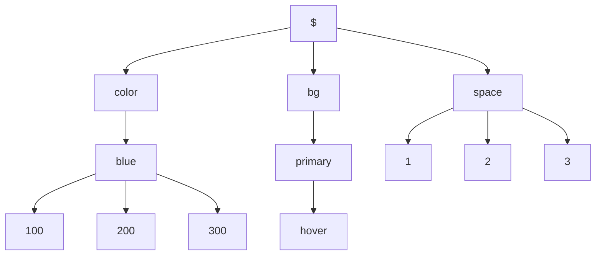

# Defining Tokens

Here you will learn how to define tokens inside a preset for theme generation, before reading this doc, make sure you understand [Design tokens](/guides/styling/design-tokens).

## The token tree

The token tree is represented by the [tokens](/guides/theming/configuration-presets#tokens) javascript object use inside the `defineConfig` function. Consider the following configuration:

```ts filename="shoreline.config.ts"
export default defineConfig({
  tokens: {
    color: {
      blue: {
        100: '#0020FA',
        200: '#0040FA',
        300: '#0060FA',
      },
    },
    bg: {
      primary: {
        hover: '$color-blue-300',
      },
    },
    space: {
      1: '1rem',
      2: '2rem',
      3: '3rem',
    },
  },
})
```

Representing this configuration visually on a tree structure, we obtain:



**Each leaf on the tree represents a token**. We can have two conclusions:

1. Token naming is defined by [nesting](#nesting).
2. Token consistency is bound to the definition, not the code.

The leaves of the tree are:

```md
- $color-blue-100 = #0020FA
- $color-blue-200 = #0040FA
- $color-blue-300 = #0060FA
- $bg-primary-hover = $color-blue-100
- $space-1 = 1rem
- $space-2 = 2rem
- $space-3 = 3rem
```

They can be represented as CSS variables:

```css
:root {
  --sl-color-blue-100: #0020fa;
  --sl-color-blue-200: #0040fa;
  --sl-color-blue-300: #0060fa;
  --sl-bg-primary-hover: var(--sl-color-blue-100);
  --sl-space-1: 1rem;
  --sl-space-2: 2rem;
  --sl-space-3: 3rem;
}
```

## Nesting

Nesting allows us to reuse other token contexts:

```ts filename="shoreline.config.ts"
export default defineConfig({
  color: {
    pink: {
      50: 'oklch(50% 0.212 340)',
      60: 'oklch(60% 0.212 340)',
      70: 'oklch(70% 0.212 340)',
    },
  },
})
```

In CSS:

```css filename="shoreline/styles.css"
@layer sl-tokens {
  :root {
    --sl-color-pink-50: oklch(50% 0.212 340);
    --sl-color-pink-60: oklch(60% 0.212 340);
    --sl-color-pink-70: oklch(70% 0.212 340);
  }
}
```

### Default Values

The default value of a branch is represented by the `'*'` key. Use default values to simplify your tokens:

```ts filename="shoreline.config.ts"
export default defineConfig({
  tokens: {
    bg: {
      primary: {
        '*': 'oklch(50% 0.212 340)',
        hover: 'oklch(60% 0.212 340)',
        active: 'oklch(70% 0.212 340)',
      },
    },
  },
})
```

In CSS:

```css filename="shoreline/styles.css"
@layer sl-tokens {
  :root {
    --sl-color-primary: oklch(50% 0.212 340);
    --sl-color-primary-hover: oklch(60% 0.212 340);
    --sl-color-primary-active: oklch(70% 0.212 340);
  }
}
```

## Alias

Tokens can [reference other tokens](/guides/styling/design-tokens#token-alias):

```ts filename="shoreline.config.ts"
export default defineConfig({
  tokens: {
    color: {
      pink: {
        50: 'oklch(50% 0.212 340)',
        60: 'oklch(60% 0.212 340)',
        70: 'oklch(70% 0.212 340)',
      },
    },
    bg: {
      primary: {
        '*': '$color-pink-70',
        hover: '$color-pink-60',
        active: '$color-pink-50',
      },
    },
  },
})
```

In CSS:

```css filename="shoreline/styles.css"
@layer sl-tokens {
  :root {
    --sl-color-pink-50: oklch(50% 0.212 340);
    --sl-color-pink-60: oklch(60% 0.212 340);
    --sl-color-pink-70: oklch(70% 0.212 340);
    --sl-bg-primary: var(--sl-color-pink-70);
    --sl-bg-primary-hover: var(--sl-color-pink-60);
    --sl-bg-primary-active: var(--sl-color-pink-50);
  }
}
```

## Composite tokens

By using aliases[#alias], you can define [composite tokens](/guides/styling/design-tokens#composite-tokens):

```ts filename="shoreline.config.ts"
export default defineConfig({
  tokens: {
    lightness: {
      bright: '50%',
      dark: '60%',
      darkest: '70%',
    },
    color: {
      pink: {
        chroma: '0.212',
        hue: '340',
        50: `oklch(
          $lightness-bright
          $color-pink-chroma
          $color-pink-hue
        )`,
        60: `oklch(
          $lightness-dark
          $color-pink-chroma
          $color-pink-hue
        )`,
        70: `oklch(
          $lightness-darkest
          $color-pink-chroma
          $color-pink-hue
        )`,
      },
      blue: {
        chroma: '0.148',
        hue: '258.88',
        50: `oklch(
          $lightness-bright
          $color-blue-chroma
          $color-blue-hue
        )`,
        60: `oklch(
          $lightness-dark
          $color-blue-chroma
          $color-blue-hue
        )`,
        70: `oklch(
          $lightness-darkest
          $color-blue-chroma
          $color-blue-hue
        )`,
      },
    },
  },
})
```

In CSS:

```css filename="shoreline/styles.css"
@layer sl-tokens {
  :root {
    --sl-lightness-bright: 70%;
    --sl-lightness-dark: 60%;
    --sl-lightness-darkest: 50%;
    --sl-color-pink-chroma: 0.212;
    --sl-color-pink-hue: 340;
    --sl-color-pink-50: oklch(
      var(--sl-lightness-bright) var(--sl-color-pink-chroma) var(--sl-color-pink-hue)
    );
    --sl-color-pink-60: oklch(
      var(--sl-lightness-dark) var(--sl-color-pink-chroma) var(--sl-color-pink-hue)
    );
    --sl-color-pink-70: oklch(
      var(--sl-lightness-darkest) var(--sl-color-pink-chroma) var(--sl-color-pink-hue)
    );
    --sl-color-blue-chroma: 0.148;
    --sl-color-blue-hue: 258.88;
    --sl-color-blue-50: oklch(
      var(--sl-lightness-bright) var(--sl-color-blue-chroma) var(--sl-color-blue-hue)
    );
    --sl-color-blue-60: oklch(
      var(--sl-lightness-dark) var(--sl-color-blue-chroma) var(--sl-color-blue-hue)
    );
    --sl-color-blue-70: oklch(
      var(--sl-lightness-darkest) var(--sl-color-blue-chroma) var(--sl-color-blue-hue)
    );
  }
}
```
