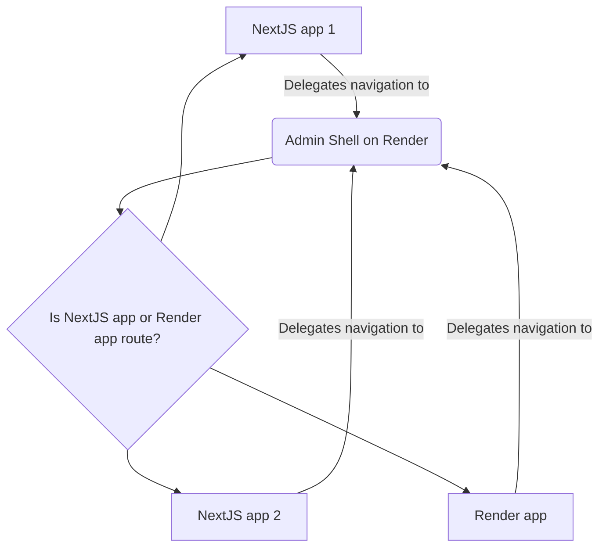

# Navigation

## Best practices

NextJS and Render routing systems are incompatible by nature. To make them work together, we need to make some compromises, such as
never using NextJS routing system with the `useRouter` hook to navigate between internal pages.

Instead, you should use the `useNavigation` hook to navigate between pages within VTEX Admin.

Under the hood, the `useNavigation` hook delegates all navigation to the Render routing system. This means that you can use it to navigate
to any page within VTEX Admin, regardless of whether it's a NextJS page or not. The Admin Shell, which is the application responsible for handling
events from Raccoon applications within the Render, will take care of routing the user to the correct page. But for it to work as expected, you should
declare the `nextjsRoutes` Raccoon property on the `admin/navigation.json` file when there are internal routes in your application.

Here is an example of a `navigation.json` file with the `nextjsRoutes` property declared:

```json
{
  "section": "orders",
  "titleId": "admin-rocket.navigation.label-group",
  "adminVersion": 4,
  "subSection": "rocket",
  "subSectionItems": [
    {
      "labelId": "admin-rocket.navigation.label-main",
      "path": "/admin/rocket",
      "raccoon": {
        "prodUrl": "",
        "nextjsRoutes": [
          "/admin/rocket/nextjs-internal-route",
          "/admin/rocket/nextjs-internal-route/:id"
        ]
      }
    }
  ]
}
```

## Navigation architecture

{/* WIP on Live editor: https://mermaid.live/edit#pako:eNp9kD9vwkAMxb-K5amVYGjHDEUJx1AGhoaNY7Byhpy4P9HlUlqFfHcuDVIz4enZ_r0nyz1WXjFmeDL-WtUUIuyFdJAqP-z4J25LoKaBtyMslx83wYbPFLkFR986Ke0dRH-D4iVXVjsoazYG0vCLneLwOkUVoxnW_WcLs0wfHtRfF3wXeTVMhvVoEPMD3o-zTT7Tm8N_yIMRT28tJmjzHMIFWg6WtErP6UeLxFizZYlZkorCRaJ0Q-Koi778dRVmMXS8wK5RKVFoOgeymJ3ItDzcAQYPdBw */}



You can find all use cases below, including this configuration above, in the shoreline-nextjs-integration example.

## Navigation use cases

### NextJS to IO

| Navigation direction                | Support |
| ----------------------------------- | ------- |
| NextJS base route to IO             | ✅      |
| NextJS internal static route to IO  | ✅      |
| NextJS internal dynamic route to IO | ❌      |

### NextJS to NextJS

| Navigation direction                                          | Support |
| ------------------------------------------------------------- | ------- |
| NextJS base route to NextJS internal static route             | ✅      |
| NextJS base route to NextJS internal dynamic route            | ❌      |
| NextJS internal static route to NextJS base route             | ✅      |
| NextJS internal static route to NextJS internal dynamic route | ❌      |

### IO to NextJS

| Navigation direction                | Support |
| ----------------------------------- | ------- |
| IO to NextJS base route             | ✅      |
| IO to NextJS internal static route  | ✅      |
| IO to NextJS internal dynamic route | ❌      |

### Window to NextJS

| Navigation direction                    | Support |
| --------------------------------------- | ------- |
| Window to NextJS base route             | ✅      |
| Window to NextJS internal static route  | ✅      |
| Window to NextJS internal dynamic route | ❌      |
