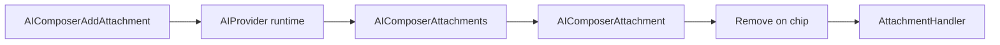

# Composer guide

> **Status:** experimental

Shoreline-styled chat input for AI apps: the **`AIComposer*`** family from `@vtex/shoreline-ai` (pill layout, footer slots, circular send, file attachments, built-in i18n). Draft state lives in the package runtime — mount inside `<AIProvider>`.

Related guides: [RUNTIME.md](./RUNTIME.md) (builder, `AttachmentHandler`), [PROVIDER.md](./PROVIDER.md), [HOOKS.md](./HOOKS.md) (`useAIComposer`, `useAIStatus`).

**Prerequisites:** `<AIProvider runtime={runtime}>` wrapping your chat UI. For file upload, register an `AttachmentHandler` on the runtime builder (see [RUNTIME.md](./RUNTIME.md#attachmenthandler)).

## Setup

```tsx
import '@vtex/shoreline/css'
import '@vtex/shoreline-ai/css'

import { LocaleProvider } from '@vtex/shoreline'
import {
  AIProvider,
  AIComposer,
  AIComposerField,
  AIComposerAttachments,
  AIComposerInput,
  AIComposerFooter,
  AIComposerAddAttachment,
  AIComposerActions,
  AIComposerAction,
} from '@vtex/shoreline-ai'
```

Wrap with `LocaleProvider` so labels and placeholders use the built-in catalogs (`en-US`, `pt-BR`).

## Quick start

Normative tree (matches AI Workspace layout: attachments and textarea inside the pill, footer with left slots + send on the right):

```tsx
<LocaleProvider locale="pt-BR">
  <AIProvider runtime={runtime}>
    <AIComposer loading={isAppLoading}>
      <AIComposerField>
        <AIComposerAttachments />
        <AIComposerInput />
        <AIComposerFooter>
          <AIComposerAddAttachment />
          {/* App slots: agent pill, menus, etc. */}
          <AIComposerActions>
            <AIComposerAction />
          </AIComposerActions>
        </AIComposerFooter>
      </AIComposerField>
    </AIComposer>
  </AIProvider>
</LocaleProvider>
```

## Components

| Component | Purpose |
|-----------|---------|
| `AIComposer` | Root form; `loading` swaps in skeleton; optional `messages` overrides i18n |
| `AIComposerField` | Pill container (border, min/max height) |
| `AIComposerAttachments` | Pending file chips above the input |
| `AIComposerInput` | Draft textarea |
| `AIComposerFooter` | Bottom row: start slot (left) + actions slot (right) |
| `AIComposerAddAttachment` | `+` button to open the file picker |
| `AIComposerActions` | Right cluster — wrap send/cancel here |
| `AIComposerSend` | Circular send button |
| `AIComposerCancel` | Stop button while a run is streaming |
| `AIComposerAction` | Toggles send ↔ cancel from `useAIStatus()` |
| `AIComposerSkeleton` | Loading placeholder (also used when `AIComposer loading`) |
| `AIComposerAttachment` | Single chip — use only inside `AIComposerAttachments` |

## Composition variants

### Default — `AIComposerAction`

One control that sends when idle and stops while streaming. Send is disabled when the draft is empty (`useAIComposer().disabled`).

```tsx
<AIComposerActions>
  <AIComposerAction />
</AIComposerActions>
```

### Explicit send and cancel

```tsx
import { useAIStatus } from '@vtex/shoreline-ai'

function ComposerSendSlot() {
  const { isStreaming } = useAIStatus()

  return (
    <AIComposerActions>
      {isStreaming ? <AIComposerCancel /> : <AIComposerSend />}
    </AIComposerActions>
  )
}
```

### Loading on `AIComposer`

```tsx
<AIComposer loading={isAppLoading}>
  {/* children ignored while loading */}
</AIComposer>
```

When `loading={true}`, only `AIComposerSkeleton` is rendered — no interactive form.

### Skeleton outside the composer

Use before the provider is ready or in layouts without a full composer:

```tsx
<AIComposerSkeleton />
<AIComposerSkeleton compact />
```

### Footer with product slots

Any child of `AIComposerFooter` that is **not** `AIComposerActions` is placed in the left cluster (`[data-sl-ai-composer-footer-start]`): attachment button, agent pill, menus, etc.

```tsx
<AIComposerFooter>
  <AIComposerAddAttachment accept="image/*,application/pdf" />
  <AgentPill />
  <AIComposerActions>
    <AIComposerAction />
  </AIComposerActions>
</AIComposerFooter>
```

### Attachments with upload

1. Register `AttachmentHandler` on the runtime builder ([RUNTIME.md](./RUNTIME.md)).
2. Render `<AIComposerAttachments />` as the first child of `AIComposerField`.
3. User picks files via `<AIComposerAddAttachment />` → chips appear → send includes uploaded resources.

```tsx
<AIComposerField>
  <AIComposerAttachments />
  <AIComposerInput />
  <AIComposerFooter>
    <AIComposerAddAttachment multiple accept="*/*" />
    <AIComposerActions>
      <AIComposerAction />
    </AIComposerActions>
  </AIComposerFooter>
</AIComposerField>
```

### Custom attachment chip

```tsx
<AIComposerAttachments>
  {({ attachment }) => (
    <AIComposerAttachment attachment={attachment} />
  )}
</AIComposerAttachments>
```

### Toolbar with `useAIComposer()`

Read or change the draft outside the textarea. For sending **without** using the draft, use `useAIThread().sendMessage` instead ([HOOKS.md](./HOOKS.md)).

```tsx
import { useAIComposer } from '@vtex/shoreline-ai'

function PromptToolbar() {
  const { text, disabled, setText, send, reset } = useAIComposer()

  return (
    <>
      <button type="button" onClick={() => setText('Summarize this page')}>
        Prefill
      </button>
      <button type="button" onClick={reset}>
        Clear
      </button>
      <button type="button" disabled={disabled} onClick={send}>
        Send draft
      </button>
      <span>{text.length} chars</span>
    </>
  )
}
```

## `<AIComposer>`

| Prop | Default | Purpose |
|------|---------|---------|
| `loading` | `false` | Renders skeleton instead of the interactive composer |
| `messages` | — | Partial override of the internal i18n catalog |
| `children` | — | Composer subtree (`AIComposerField`, etc.) |

Message ids: `send`, `cancel`, `removeAttachment`, `addAttachment`, `placeholder`.

```tsx
<AIComposer messages={{ send: 'Enviar', placeholder: 'Pergunte algo…' }} />
```

Only `AIComposer` accepts `messages`; child components read from context.

## Subcomponent props

### `AIComposerInput`

| Prop | Default | Purpose |
|------|---------|---------|
| `placeholder` | Catalog | Input placeholder |
| `rows` | `1` | Visible row count |
| `autoFocus` | `false` | Focus on mount |

### `AIComposerAddAttachment`

| Prop | Default | Purpose |
|------|---------|---------|
| `accept` | — | File types (e.g. `image/*`) |
| `multiple` | `true` | Allow multi-select |

### `AIComposerAttachments`

| Prop | Purpose |
|------|---------|
| `children` | Optional `( { attachment } ) => ReactNode`; default renders `AIComposerAttachment` |

### `AIComposerAttachment`

| Prop | Purpose |
|------|---------|
| `attachment` | Attachment data from the composer list |

No `onRemove` prop — removal is handled by the chip’s control and the runtime handler.

### `AIComposerSkeleton`

| Prop | Default | Purpose |
|------|---------|---------|
| `compact` | `false` | Single-line skeleton variant |

`AIComposerSend`, `AIComposerCancel`, and `AIComposerAction` do not accept `children`; labels come from i18n.

## Send and stop

| State | Component | Visual |
|-------|-----------|--------|
| Draft empty / cannot send | `AIComposerSend` | Disabled, muted circle (`useAIComposer().disabled`) |
| Can send | `AIComposerSend` | Blue 40×40 circle |
| Streaming | `AIComposerCancel` or `AIComposerAction` | Stop control (`useAIStatus().isStreaming`) |

`stopGeneration()` from `useAIThread()` has the same effect as the cancel button.

## Attachments



- Always list chips with `<AIComposerAttachments />` inside `AIComposerField`.
- Do not mount `<AIComposerAttachment />` alone — it must be inside the attachments list.
- Removing a file updates composer state via the registered handler; apps do not pass `onRemove`.

## Hooks

| Hook | Use for |
|------|---------|
| `useAIComposer()` | Draft `text`, `attachments`, `disabled`, `setText`, `send`, `reset` |
| `useAIStatus()` | `isStreaming` for cancel / `AIComposerAction` |
| `useAIThread()` | `sendMessage` bypasses draft; `stopGeneration` cancels run |

Details: [HOOKS.md](./HOOKS.md).

## Input and styles

`AIComposerInput` renders a textarea wired to the package composer state. Do not replace it with a controlled Shoreline `<Textarea />` bound to local React state — the draft must stay in the runtime behind `<AIProvider>`.

Import package CSS once:

```tsx
import '@vtex/shoreline-ai/css'
```

Stable `data-sl-*` hooks for app overrides:

| Attribute | Region |
|-----------|--------|
| `[data-sl-ai-composer]` | Root form |
| `[data-sl-ai-composer-field]` | Pill |
| `[data-sl-ai-composer-attachments]` | Chip list |
| `[data-sl-ai-composer-attachment]` | Single chip |
| `[data-sl-ai-composer-footer]` | Footer row |
| `[data-sl-ai-composer-footer-start]` | Left cluster (+, agent pill, etc.) |
| `[data-sl-ai-composer-actions]` | Right cluster |
| `[data-sl-ai-composer-send]` | Send button |
| `[data-sl-ai-composer-cancel]` | Stop button |
| `[data-sl-ai-composer-add-attachment]` | `+` button |
| `[data-sl-ai-composer-skeleton]` | Loading skeleton |

## i18n

Built-in locales: `en-US`, `pt-BR`. Override only on the root:

```tsx
<AIComposer messages={{ send: 'Enviar' }} />
```

Unset keys fall back to the active `LocaleProvider` catalog.
