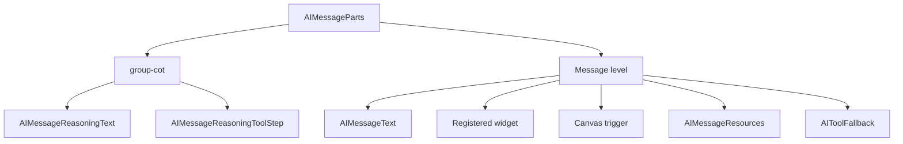
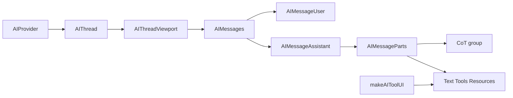

# Messages guide

> **Status:** experimental

Shoreline-styled message rendering for AI apps: the **`AIMessage*`** family from `@vtex/shoreline-ai` (user bubble, assistant Chain of Thought, markdown text, tool widgets, resource attachments). Mount inside `<AIProvider>` and typically inside `AIThreadViewport`.

Related guides: [THREAD.md](./THREAD.md) (viewport layout), [PROVIDER.md](./PROVIDER.md), [HOOKS.md](./HOOKS.md) (message part hooks), [TOOL-UI.md](./TOOL-UI.md) (`makeAIToolUI`, canvas), [RUNTIME.md](./RUNTIME.md) (`AIMessage` / `AIMessagePart` model).

**Prerequisites:** `<AIProvider runtime={runtime}>` wrapping your chat UI. Import `@vtex/shoreline/css` and `@vtex/shoreline-ai/css`. Wrap with `LocaleProvider` so built-in labels use the `en-US` / `pt-BR` catalogs.

## Setup

```tsx
import '@vtex/shoreline/css'
import '@vtex/shoreline-ai/css'

import { LocaleProvider } from '@vtex/shoreline'
import {
  AIProvider,
  AIThread,
  AIThreadViewport,
  AIThreadEmpty,
  AIThreadViewportFooter,
  AIMessages,
} from '@vtex/shoreline-ai'
```

## Quick start

Normative tree: message list inside the thread viewport, between the empty slot and the sticky footer.

```tsx
<LocaleProvider locale="pt-BR">
  <AIProvider runtime={runtime}>
    <AIThread>
      <AIThreadViewport autoScroll>
        <AIThreadEmpty>{/* welcome */}</AIThreadEmpty>
        <AIMessages />
        <AIThreadViewportFooter>
          {/* scroll-to-bottom, composer, alerts */}
        </AIThreadViewportFooter>
      </AIThreadViewport>
    </AIThread>
  </AIProvider>
</LocaleProvider>
```

Drop-in usage requires no props — user and assistant layouts, CoT grouping, markdown, and tool routing are handled internally.

## Message part model

Each message is an `AIMessage` with a `parts` array. Parts are typed as `AIMessagePart`:

| Type | Fields | Default rendering |
|------|--------|-------------------|
| `text` | `text` | `AIMessageText` → GFM markdown |
| `reasoning` | `text`, `status: 'streaming' \| 'complete'` | CoT panel → `AIMessageReasoningText` |
| `tool` | `name`, `args`, `output`, `status`, `error?`, `metadata?` | Widget, canvas trigger, CoT step, or fallback |
| `resource` | `uri`, `name`, `mimeType` | Image preview or file row |

Full message shape and transport details: [RUNTIME.md](./RUNTIME.md). Read thread history via `useAIThread().messages`.

## Components

### List and layout

| Component | Purpose |
|-----------|---------|
| `AIMessages` | Full message list — drop-in with default user/assistant templates |
| `AIMessageUser` | User message shell (right-aligned bubble) |
| `AIMessageAssistant` | Assistant message shell (left-aligned, CoT + tools) |
| `AIMessageRoot` | Single-message container; sets `messageRole` |
| `AIMessageParts` | Part iteration, CoT grouping, optional custom renderer |

### Content

| Component | Purpose |
|-----------|---------|
| `AIMessageText` | Text part rendered as markdown |
| `AIMarkdown` | Standalone GFM markdown (no streaming cursor) |
| `AIMessageReasoningRoot` | Collapsible CoT panel |
| `AIMessageReasoningHeader` | Header with trigger and streaming indicator |
| `AIMessageReasoningTrigger` | Expand/collapse button |
| `AIMessageReasoningContent` | Collapsible body |
| `AIMessageReasoningText` | Reasoning text inside CoT |
| `AIMessageReasoningToolStep` | Compact step for unregistered tools in CoT |
| `AIMessageResources` | Container for resource parts |
| `AIMessageResource` | Auto image or file chip |
| `AIMessageResourceImage` | Image preview variant |
| `AIMessageResourceFile` | File row variant |

### Helpers

| Export | Purpose |
|--------|---------|
| `renderDefaultParts(part, meta, options?)` | Built-in renderer — use as fallback in hybrid overrides |

## Composition variants

### Drop-in (default)

```tsx
<AIMessages />
```

Renders every message with built-in `AIMessageUser` and `AIMessageAssistant` presets. User messages appear as a right-aligned bubble; assistant messages show CoT, text, registered tools, and attachments.

### Explicit templates

Pass at most **one** `AIMessageUser` and **one** `AIMessageAssistant` as children. Duplicates throw at runtime.

```tsx
<AIMessages showReasoningTools={false}>
  <AIMessageUser />
  <AIMessageAssistant showReasoningTools={false} />
</AIMessages>
```

Use explicit templates when you need to wrap assistant content (for example a future action bar) without reimplementing the message list.

### Custom part renderer

`AIMessageParts` accepts a function child `(part, meta) => ReactNode`. Return a node to replace default rendering for that part; return `null` or `undefined` to fall through to the built-in renderer.

```tsx
<AIMessages>
  <AIMessageAssistant>
    <AIMessageParts>
      {(part, meta) =>
        part.type === 'text' ? (
          <p data-app-custom-text>{part.text}</p>
        ) : null
      }
    </AIMessageParts>
  </AIMessageAssistant>
</AIMessages>
```

### Hybrid override (HITL or single tool)

Handle one part type locally; delegate everything else to `renderDefaultParts`:

```tsx
import { AIMessageParts, renderDefaultParts } from '@vtex/shoreline-ai'

<AIMessageParts>
  {(part, meta) => {
    if (part.type === 'tool' && part.name === 'hitl-approve') {
      return (
        <HitlWidget
          args={part.args}
          status={part.status}
          output={part.output}
          metadata={part.metadata}
        />
      )
    }
    return renderDefaultParts(part, meta)
  }}
</AIMessageParts>
```

Local overrides take precedence over globally registered `makeAIToolUI` components on the same surface.

### Hide CoT tool steps

Set `showReasoningTools={false}` on `AIMessages`, `AIMessageAssistant`, or `AIMessageParts`. Reasoning text still renders inside the CoT panel; compact tool steps for unregistered tools are omitted.

Registered widget and canvas tools always render at message level regardless of this flag.

### Explicit resource variants

For isolated rendering outside the automatic part flow, use explicit variants instead of a generic escape prop:

```tsx
<AIMessageResourceImage />
<AIMessageResourceFile />
```

Inside the default flow, `AIMessageResource` picks the variant from the current part scope.

### Standalone reasoning compound

Build a custom CoT layout without changing grouping rules:

```tsx
<AIMessageReasoningRoot defaultExpanded={false}>
  <AIMessageReasoningHeader streaming={isStreaming} />
  <AIMessageReasoningContent>
    <AIMessageReasoningText />
  </AIMessageReasoningContent>
</AIMessageReasoningRoot>
```

`AIMessageReasoningTrigger` must be used inside `AIMessageReasoningRoot`.

### Static markdown

Use `AIMarkdown` outside the message stream for docs, previews, or non-streaming content:

```tsx
<AIMarkdown>{'# Hello\n\nParagraph with **bold**.'}</AIMarkdown>
```

## Chain of Thought and tool routing

Assistant parts are grouped automatically. Reasoning and unregistered tools belong to the CoT group; text, resources, and registered tools render at message level.



| Part | `makeAIToolUI` registration | `showReasoningTools` | Renders at |
|------|----------------------------|----------------------|------------|
| `reasoning` | — | — | CoT panel |
| `tool` (no UI) | none | `true` | CoT step |
| `tool` (no UI) | none | `false` | Omitted from CoT; fallback at message level |
| `tool` | `widget` | any | Message level (inline widget) |
| `tool` | `canvas` | any | Message level (trigger + `<AICanvas>`) |
| `text`, `resource` | — | — | Message level |

Register tools at app setup with `makeAIToolUI` — see [TOOL-UI.md](./TOOL-UI.md). Mount registered tool components once under `<AIProvider>`.

During streaming, adjacent CoT members coalesce into one collapse panel so reasoning and tool steps appear in arrival order.

## Accessing state

### Inside a custom renderer — `AIMessagePartMeta`

Every function child on `AIMessageParts` receives a second argument with derived context:

```ts
type AIMessagePartMeta = {
  index: number
  isStreaming: boolean
  placement: 'cot' | 'message'
  toolRegistration: AIToolRegistration | null
}
```

| Field | Use |
|-------|-----|
| `index` | 0-based position of the part in the message |
| `isStreaming` | `true` while the part is actively updating |
| `placement` | `'cot'` inside the reasoning panel; `'message'` at message level |
| `toolRegistration` | Registry entry when the part is a registered tool; otherwise `null` |

Prefer `meta.isStreaming` and `meta.placement` in custom renderers instead of subscribing to the full thread state.

### Message part hooks

Use inside `<AIProvider>`. Omit `messageId` when called inside an `AIMessage*` tree; pass `messageId` to read a specific message from elsewhere.

| Hook | Returns | When to use |
|------|---------|-------------|
| `useAIMessageParts(messageId?)` | `AIMessagePart[]` | Full normalized model — **preferred** |
| `useAIReasonings(messageId?)` | `AIReasoningPart[]` | Reasoning parts only |
| `useAITools(messageId?)` | `AIToolPart[]` | Tool parts only |
| `useAIResources(messageId?)` | `AIResourcePart[]` | Resource parts from `data` payloads only |

**Important:** `useAIResources` does **not** include image or file upload parts. For all attachments, use `useAIMessageParts` and filter `part.type === 'resource'`.

Details and examples: [HOOKS.md](./HOOKS.md#message-hooks).

### Thread-level hooks

```ts
const { messages, loadMessages, sendMessage } = useAIThread()
const { isStreaming } = useAIStatus()
```

Example — sidebar preview of the last assistant reply:

```tsx
import { useAIThread, useAIMessageParts } from '@vtex/shoreline-ai'

function LastAssistantSummary() {
  const { messages } = useAIThread()
  const last = [...messages].reverse().find((m) => m.role === 'assistant')
  const parts = useAIMessageParts(last?.id)
  const text = parts.find((p) => p.type === 'text')?.text

  if (!text) return null

  return <p>{text.slice(0, 120)}…</p>
}
```

## Props reference

### `<AIMessages>`

| Prop | Default | Purpose |
|------|---------|---------|
| `showReasoningTools` | `true` | Compact tool steps inside CoT for unregistered tools |
| `messages` | — | Partial i18n override |
| `children` | — | Optional `AIMessageUser` + `AIMessageAssistant` templates |

Also accepts native `div` attributes.

### `<AIMessageAssistant>`

| Prop | Default | Purpose |
|------|---------|---------|
| `showReasoningTools` | `true` | Same as on `AIMessages` |
| `children` | `AIMessageParts` | Compose `AIMessageParts` and siblings (action bar, etc.) |

### `<AIMessageParts>`

| Prop | Default | Purpose |
|------|---------|---------|
| `showReasoningTools` | `true` | Same as above |
| `children` | — | Optional `(part, meta) => ReactNode` renderer |

### `<AIMessageReasoningRoot>`

| Prop | Default | Purpose |
|------|---------|---------|
| `defaultExpanded` | `false` | Whether the CoT panel starts open |

### `<AIMessageReasoningTrigger>`

| Prop | Purpose |
|------|---------|
| `label` | Override collapse button label |
| `streaming` | Shows streaming indicator on the trigger |

### `<AIMarkdown>`

| Prop | Purpose |
|------|---------|
| `children` | Markdown source string |

`AIMessageUser`, `AIMessageRoot`, `AIMessageText`, and resource components accept standard `div` HTML attributes. `AIMessageReasoningToolStep` requires a `part: AIToolPart` prop when used standalone.

## i18n

Built-in locales: `en-US`, `pt-BR`.

| Message id | Default (`en-US`) |
|------------|-------------------|
| `reasoningStreaming` | Reasoning… |
| `reasoningReady` | Reasoning |
| `copyMessage` | Copy message |
| `copyCode` | Copy code |

Override only on the root:

```tsx
<AIMessages messages={{ reasoningReady: 'Raciocínio concluído' }} />
```

Unset keys fall back to the active `LocaleProvider` catalog.

## Styling hooks

Import package CSS once:

```tsx
import '@vtex/shoreline-ai/css'
```

Stable `data-sl-*` hooks for app overrides. Use only `--sl-*` tokens inside `@layer sl-components`.

| Attribute | Region |
|-----------|--------|
| `[data-sl-ai-messages]` | Message list |
| `[data-sl-ai-message][data-sl-ai-message-role="user"]` | User message — right-aligned, max 85% width |
| `[data-sl-ai-message][data-sl-ai-message-role="assistant"]` | Assistant message — left-aligned |
| `[data-sl-ai-message-content]` | Message content wrapper |
| `[data-sl-ai-message-parts]` | Parts container |
| `[data-sl-ai-message-reasoning]` | CoT panel |
| `[data-sl-ai-message-reasoning-header]` | CoT header row |
| `[data-sl-ai-message-reasoning-trigger]` | CoT expand/collapse control |
| `[data-sl-ai-message-reasoning-content]` | CoT body (left border) |
| `[data-sl-ai-message-reasoning-tool-step]` | Compact tool step in CoT |
| `[data-sl-ai-message-text]` | Text part |
| `[data-sl-ai-markdown]` | Markdown output |
| `[data-sl-ai-dots-loader]` | Streaming indicator in CoT header |
| `[data-sl-ai-message-resources]` | Resource attachments row |
| `[data-sl-ai-message-resource]` | Single attachment chip |
| `[data-sl-ai-message-resource-image]` | Image preview |
| `[data-sl-ai-message-resource-icon]` | File icon |
| `[data-sl-ai-message-resource-info]` | File name and mime type |

User bubble styling is applied via CSS on `[data-sl-ai-message-role="user"] [data-sl-ai-message-content]` — no dedicated bubble component.

## Best practices

### Composition

- Start with `<AIMessages />` and add explicit templates only when layout requirements grow.
- Override individual parts via `AIMessageParts` function children — do not reimplement the full message list or CoT grouping.
- Prefer explicit variants (`AIMessageResourceImage`, `AIMessageResourceFile`) over generic props when rendering resources in isolation.
- Local `AIMessageParts` overrides win over global `makeAIToolUI` on the same surface.

### Performance

- In custom renderers, read `meta.isStreaming` and `meta.placement` instead of subscribing to the entire thread.
- When building custom hooks, avoid selectors that return new object references on every render — subscribe to primitive values separately.
- Import from `@vtex/shoreline-ai` barrel exports; avoid deep package paths.
- Return `null` early for parts you do not customize; call `renderDefaultParts` for the rest.

### Shoreline

- Import `@vtex/shoreline/css` and `@vtex/shoreline-ai/css` once at the app root.
- Style overrides through `data-sl-*` selectors and `--sl-*` tokens.
- Keep `LocaleProvider` above the chat tree for localized labels.

### Anti-patterns

| Avoid | Prefer |
|-------|--------|
| Using `useAIResources` for image/file attachments | `useAIMessageParts` + filter `type === 'resource'` |
| Duplicating CoT grouping logic | Default grouping via `AIMessageParts` (no public `groupBy` in v0) |
| Replacing `AIMessageText` with a controlled local textarea for streaming | `AIMessageParts` override that reads `meta.isStreaming` |
| Styling user bubbles with ad hoc classes | `[data-sl-ai-message-role="user"]` + tokens |

## Integration overview



Mount `<AICanvas />` alongside the thread when using canvas-mode tools. Thread layout details: [THREAD.md](./THREAD.md).
