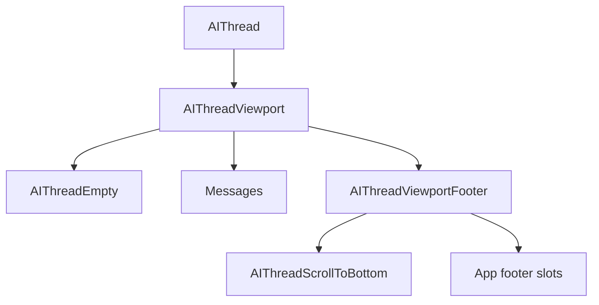

# Thread guide

> **Status:** experimental

Shoreline-styled chat **layout** for AI apps: the **`AIThread*`** family from `@vtex/shoreline-ai` (scrollable viewport, empty slot, sticky viewport footer, scroll-to-bottom). Mount inside `<AIProvider>`.

Related guides: [PROVIDER.md](./PROVIDER.md), [HOOKS.md](./HOOKS.md) (`useAIThread`, `sendMessage`, multi-thread), [RUNTIME.md](./RUNTIME.md) (`loadMessages`).

**Prerequisites:** `<AIProvider runtime={runtime}>` wrapping your chat UI. Import `@vtex/shoreline/css` and `@vtex/shoreline-ai/css`. Wrap with `LocaleProvider` so built-in labels use the `en-US` / `pt-BR` catalogs.

## Setup

```tsx
import '@vtex/shoreline/css'
import '@vtex/shoreline-ai/css'

import { LocaleProvider } from '@vtex/shoreline'
import {
  AIProvider,
  AIThread,
  AIThreadViewport,
  AIThreadEmpty,
  AIThreadViewportFooter,
  AIThreadScrollToBottom,
  useAIThread,
} from '@vtex/shoreline-ai'
```

## Quick start

Normative tree: empty slot and message area inside the viewport; sticky footer with scroll control first, then app footer content.

```tsx
<LocaleProvider locale="pt-BR">
  <AIProvider runtime={runtime}>
    <AIThread>
      <AIThreadViewport autoScroll>
        <AIThreadEmpty>{/* welcome */}</AIThreadEmpty>
        {/* messages */}
        <AIThreadViewportFooter>
          <AIThreadScrollToBottom />
          {/* footer: input, alerts */}
        </AIThreadViewportFooter>
      </AIThreadViewport>
    </AIThread>
  </AIProvider>
</LocaleProvider>
```

**Child order inside `AIThreadViewport`:** `AIThreadEmpty` (optional) → messages (optional) → `AIThreadViewportFooter` (when the surface has a fixed footer). Inside the footer, mount `AIThreadScrollToBottom` as the **first child** so it floats above later footer slots.

`AIThreadViewport` is the scroll container. `AIThreadViewportFooter` stays sticky at the bottom of the viewport. The scroll-to-bottom control is positioned above the footer via `[data-sl-ai-thread-scroll-to-bottom]`.

## Components

| Component | Purpose |
|-----------|---------|
| `AIThread` | Root container; optional `messages` overrides i18n |
| `AIThreadViewport` | Scrollable viewport with auto-scroll on new messages and thread switches |
| `AIThreadEmpty` | Renders children only when the thread is empty and not opening |
| `AIThreadViewportFooter` | Sticky footer; height is measured for scroll inset |
| `AIThreadScrollToBottom` | Button to jump to the latest messages when not at the bottom |

## Composition variants

The quick start tree is the default. Use these variants only when behavior differs:

### Without scroll-to-bottom

Omit `AIThreadScrollToBottom` and keep only app content in the footer:

```tsx
<AIThreadViewportFooter>
  {/* footer slots */}
</AIThreadViewportFooter>
```

### Error banner in the footer

Read `useAIThread().error` and render an alert with `data-sl-ai-thread-error`:

```tsx
const { error } = useAIThread()
const openError = error?.type === 'thread_open' ? error.message : null

<AIThreadViewportFooter>
  <AIThreadScrollToBottom />
  {openError ? (
    <p role="alert" data-sl-ai-thread-error>
      {openError}
    </p>
  ) : null}
  {/* footer slots */}
</AIThreadViewportFooter>
```

### Opening a thread

While `useAIThread().isOpeningThread` is `true`:

- `AIThreadEmpty` does not render (avoids welcome flash before history hydrates).
- Mount loading UI in the footer in your app layer (for example a composer skeleton — see [COMPOSER.md](./COMPOSER.md)).



## `<AIThread>`

| Prop | Default | Purpose |
|------|---------|---------|
| `messages` | — | Partial override of the internal i18n catalog |
| `children` | — | Thread subtree (`AIThreadViewport`, etc.) |

Also accepts native `div` attributes (`className`, `style`, `id`, …).

Message ids: `scrollToBottom`.

```tsx
<AIThread messages={{ scrollToBottom: 'Ir para o fim' }} />
```

Only `AIThread` accepts `messages`; child components read from context.

## Subcomponent props

### `AIThreadViewport`

| Prop | Default | Purpose |
|------|---------|---------|
| `autoScroll` | `true` | Scroll to bottom when new messages arrive |
| `scrollToBottomOnRunStart` | `true` | Scroll to bottom when a new run starts |
| `scrollToBottomOnInitialize` | `true` | Scroll to bottom when thread history is first loaded |
| `scrollToBottomOnThreadSwitch` | `true` | Scroll to bottom when switching to a different thread |
| `children` | — | Empty slot, message area, footer |

Also accepts native `div` attributes.

### `AIThreadEmpty`

| Prop | Purpose |
|------|---------|
| `children` | Welcome or onboarding UI |

Standard `div` props. **Behavior:** renders children only when `useAIThread().isEmpty` is `true` and `isOpeningThread` is `false`; otherwise returns `null`. No package layout styles on this slot.

### `AIThreadViewportFooter`

| Prop | Purpose |
|------|---------|
| `children` | Footer slots (scroll control, input, alerts) |

Standard `div` props. Sticky at the bottom of the viewport; footer height is used to inset auto-scroll so content is not hidden behind the footer.

### `AIThreadScrollToBottom`

| Prop | Purpose |
|------|---------|
| `children` | Optional custom control content (default: caret icon) |

Standard `button` props. Hidden via `disabled` and `opacity: 0` when the viewport is already at the bottom. Must be the **first child** of `AIThreadViewportFooter`.

## Types

Exported from `@vtex/shoreline-ai`:

| Type | Description |
|------|-------------|
| `AIThreadOptions` | `messages`, `children` |
| `AIThreadProps` | `AIThreadOptions` + `div` HTML attributes |
| `AIThreadViewportOptions` | Viewport scroll props + `children` |
| `AIThreadViewportProps` | `AIThreadViewportOptions` + `div` HTML attributes |
| `AIThreadEmptyProps` | `div` HTML attributes |
| `AIThreadViewportFooterProps` | `div` HTML attributes |
| `AIThreadScrollToBottomProps` | `button` HTML attributes |
| `AIThreadMessages` | `{ scrollToBottom?: string }` |

Thread errors surfaced on `useAIThread().error`:

| Type | Description |
|------|-------------|
| `AIThreadErrorType` | `'thread_open'` |
| `AIThreadError` | `{ type: AIThreadErrorType; message: string }` |

## Hooks

Use `useAIThread()` inside `<AIProvider>` for thread layout and operations.

| Member | Use with `AIThread*` |
|--------|----------------------|
| `isEmpty` | `true` when the active thread has zero messages; mirrors when `AIThreadEmpty` would show |
| `isOpeningThread` | `true` while initial thread open is pending; suppresses `AIThreadEmpty` |
| `error` | `AIThreadError \| null` — e.g. `thread_open` for a footer alert |
| `messages` | Current thread as `AIMessage[]` |
| `threadId` | Active persistence id |
| `sendMessage` | Append user message and start a run |
| `stopGeneration` | Cancel the active run |
| `switchThread` | Cancel run, clear UI, set active thread id |
| `createThread` | New id, clear UI, return id |
| `loadMessages` | Replace thread content from `AIMessage[]` |

```tsx
const { isEmpty, isOpeningThread, error, messages } = useAIThread()
const openError = error?.type === 'thread_open' ? error.message : null
```

`isEmpty` is derived from `messages.length === 0` on the active thread.

Full `sendMessage` shapes and multi-thread flows: [HOOKS.md](./HOOKS.md#useaithread).

## i18n

Built-in locales: `en-US`, `pt-BR` (see `components/thread/messages/` in the package).

| Message id | Default (`en-US`) |
|------------|-------------------|
| `scrollToBottom` | Scroll to bottom |

Override only on the root:

```tsx
<AIThread messages={{ scrollToBottom: 'Rolar para o final' }} />
```

Unset keys fall back to the active `LocaleProvider` catalog.

## Styling hooks

Import package CSS once:

```tsx
import '@vtex/shoreline-ai/css'
```

Stable `data-sl-*` hooks for app overrides:

| Attribute | Region |
|-----------|--------|
| `[data-sl-ai-thread]` | Root |
| `[data-sl-ai-thread-viewport]` | Scrollable viewport |
| `[data-sl-ai-thread-empty]` | Empty slot (no package layout styles) |
| `[data-sl-ai-thread-viewport-footer]` | Sticky footer |
| `[data-sl-ai-thread-scroll-to-bottom]` | Scroll control (floated above footer) |
| `[data-sl-ai-thread-error]` | App error banner in footer (convention) |
