# Colors

Colors are used to reflect a product's style with consistency across all components used on the Admin UI. Each color has some specific function when applied to an element on the screen. The following concepts are part of our efforts to make the user interface harmonious and consistent. We are committed to complying with the [Web Content Accessibility Guidelines AA standard contrast ratios](https://www.w3.org/TR/WCAG/).

## Tones

The usage of the colors in our system reflect the product’s tone of voice with consistency across all components used on the applications. We make available a spectrum of tones which are leveraged across the entire component suite.

### Main

The principal interactive element on the screen. It should drive the user’s attention to the tasks that should be done using the application.

### Critical

Inform to the user that that something went wrong or that they need extreme caution before taking some action.

### Warning

It informs to the user that something is not working as it expected or that they need some caution before taking some action.

### Positive

It represents something good or new things. Get the user to be aware that something good happened.

### Neutral

Information that do not need emphasis. Already actioned in the past.

### Info

It informs or guides the user in a calm and non-urgent way.

## Semantic

|          | Main                                   | Critical                                       | Warning                                       | Positive                                             | Neutral                                    | Info                                       |
| -------- | -------------------------------------- | ---------------------------------------------- | --------------------------------------------- | ---------------------------------------------------- | ------------------------------------------ | ------------------------------------------ |
| actions  | <tone bg="main" desc="primary"></tone> | <tone bg="critical" desc="destructive"></tone> |                                               |                                                      |                                            |                                            |
| messages |                                        | <tone bg="critical" desc="error"></tone>       | <tone bg="warning" desc="warning"></tone>     | <tone bg="positive" desc="success"></tone>           |                                            | <tone bg="info" desc="information"></tone> |
| status   |                                        | <tone bg="critical" desc="removed"></tone>     | <tone bg="warning" desc="pending"></tone>     | <tone bg="positive" desc="added or complete"></tone> | <tone bg="neutral" desc="default"></tone>  |                                            |
| priority |                                        | <tone bg="critical" desc="major"></tone>       | <tone bg="warning" desc="medium"></tone>      |                                                      | <tone bg="neutral" desc="trivial"></tone>  | <tone bg="info" desc="minor"></tone>       |
| payments |                                        | <tone bg="critical" desc="cancelled"></tone>   | <tone bg="warning" desc="in progress"></tone> | <tone bg="positive" desc="completed"></tone>         | <tone bg="neutral" desc="archived"></tone> |                                            |

  

## Palettes

### Blue

We use `blue40` for primary actions (which will move the user forward in the flow) like buttons, text links, etc., and interactive elements like element selection, drag states, etc. Elements that are not actionable or interacting must not use this color.

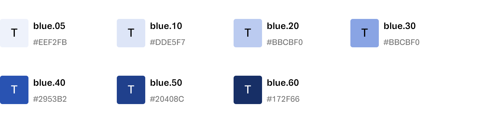

### Do

- Use `blue40` for primary actions.

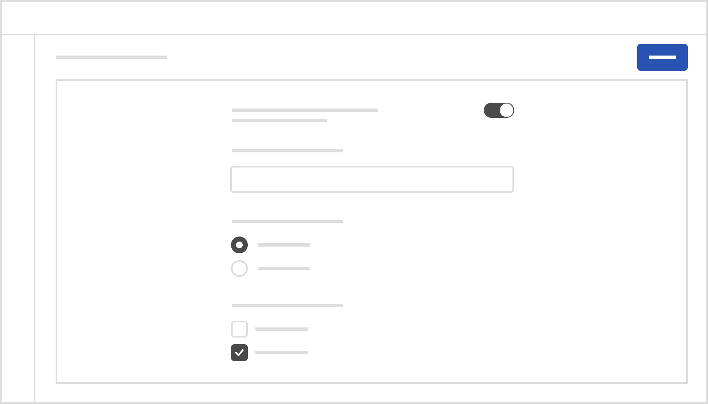

### Dont's

- Do not use `blue40` for highlighting information. Because using this color for actions may confuse when used on something like highlighting some information or text.

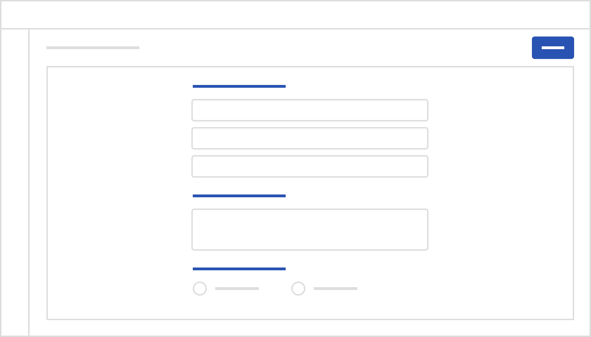

- Do not use `blue40` for the color of the backgrounds. It can interfere with the visual priorities on the page and draw attention to non-action elements. Generally, buttons should be the only elements with dark backgrounds. Nothing on the page should draw attention away from them.

### Green

- Green color is mainly used for backgrounds in positive messages, states (completed, paid, added, etc.), and progress.
- Do not use green color for next buttons.

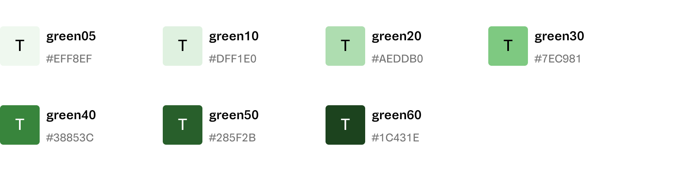

### Orange:

- Orange color is mainly used for backgrounds in warning messages, actions and in states.
- Use `orange50` for text on white backgrounds.

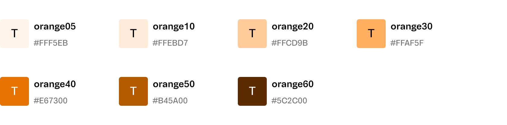

### Red

- Red color is mainly used for backgrounds in critical messages, remove, delete and in states (canceled, failed) actions.
- Use `red` color for critical buttons.

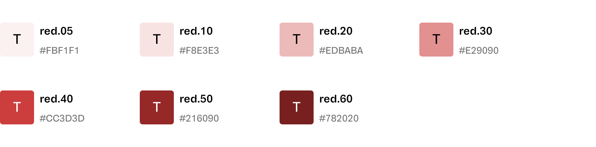

### Light Blue

- Light Blue color is mainly used for backgrounds in information messages, and status.
- Use `lightBlue` color for highlighting information such as text or numbers.
- Use `lightBlue` color for line charts.

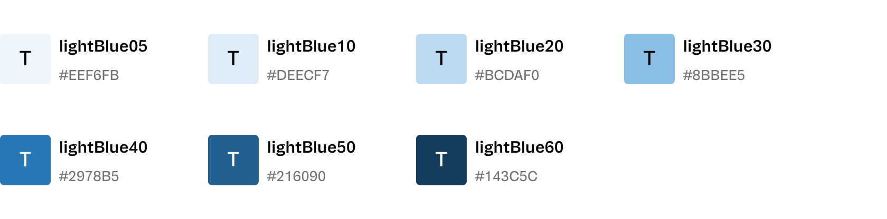

### Grey

- Use `black` color for main text.
- Use `grey50` for secondary texts, which have a lower of importance than main texts, such as captions, subtitles, descriptions, etc.
- Use `grey50` for icons colors.
- Use `white` color for main pages background.
- Use `grey10` color for highlighting background in specific scenarios like a sidebar component.
- Use `grey30` color for the main border (cards, lines, dividers, etc.)

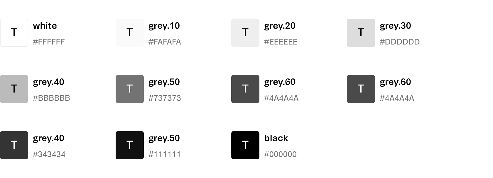

### Purple

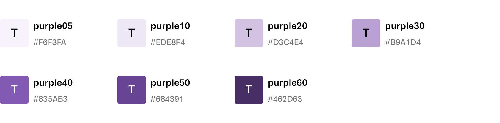

### Cyan

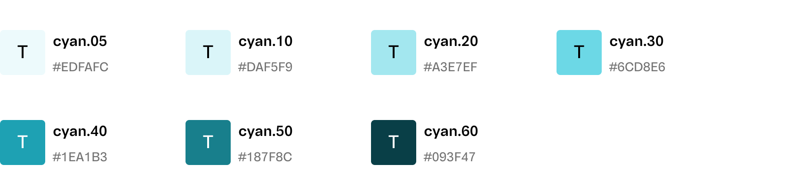

### Teal

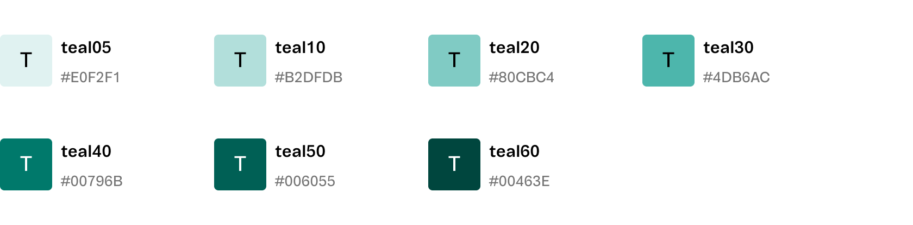

### Pink

- The `pink` color palette represents the colors corresponding to VTEX branding. These colors should only be used in specific cases such as the VTEX logo, illustrations, etc.

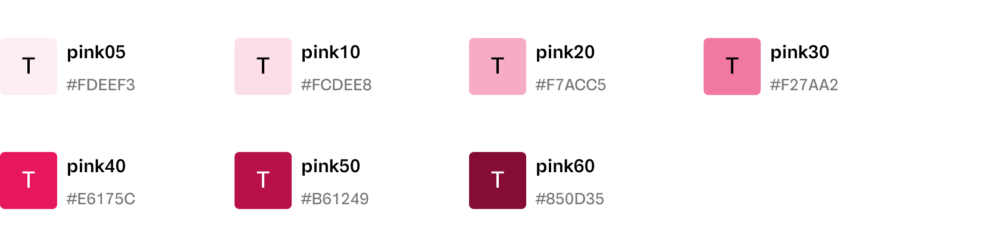

# How to use

## Design Tokens

Check the [tokens table](/foundations/design-tokens) to learn more about each token and where you can use them.

## Figma Library

### Admin UI Foundations

Use the Admin UI Foundations library to use colors in your Figma files. To use the library enable from the Figma Libraries tab. Within the library, styles are divided into three categories:

- Background: has all colors related to backgrounds.
- Foraground: has all colors related to text and icons.
- Border: has all colors related to the border color.

We even have a grouping where you can find all colors in the Admin UI; use them only if you don't see any token for the usage context you need. If it's a global context, talk to the Admin UI team about creating this new token that way, we can maintain the semantic and thematic structure throughout the entire system.

Each category is made up of a group of contextual tokens. Each token group is related to an element/component. We've created some internal groupings to make it easier to navigate and use each of the tokens.

- **Actions:** it contains all the colors related to the buttons we have in the Admin UI, including the different states (Default, Hover, Pressed, Disabled).

- **Overlay:** contains all colors related to overlay components, for example, popup, modal, popover.

- **Structure:** contains all colors related to components used in the Admin UI interface structure, for example, Sidebar, Topbar, Page Header, etc.

- **Notifications:** contains all colors related to components used to notifications messages, like Toasts and Alerts.

- **Fields:** contains all colors related to field texts components, like Inputs, TextAreas, and Selects.

- **Controls:** contains all colors related to controls components, like Checkbox, Radio Buttons, and Toggle.

- **Loading:** contains all colors related to loading components, like Skeleton.

- **List Box Item:** contains all colors related to listing item, like Icons on Sidebar component.
